## 1. Warm-up: Setup Minikube.

First thing: we need a cluster.  
If you don’t have one → **minikube** is your best friend.

You can check this [guide](https://minikube.sigs.k8s.io/docs/start/) to get started.

```bash
minikube start
minikube addons enable ingress
```
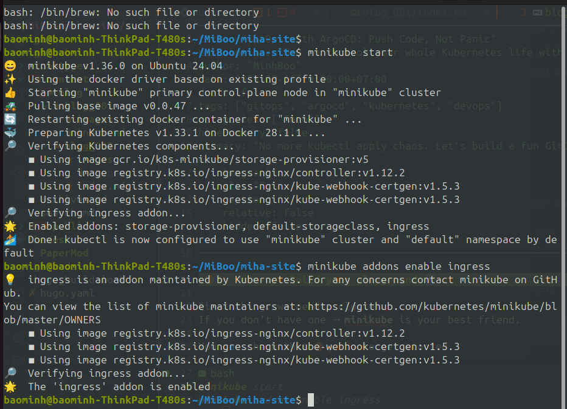

## 2. Life without GitOps.

It’s **release day**. You’ve got to update a deployment. Easy, right?  
```bash
kubectl apply -f deployment.yaml
``` 
Done! But wait, what about the other 10 clusters?  
You start copying and pasting, praying nothing breaks. But no, prod goes down and you’re left staring at logs, wondering where it all went wrong.

We need a better way to manage our Kubernetes resources and deployments. 


## 3. So.. what is GitOps? 

GitOps uses Git as the single source of truth. You define your desired Kubernetes state in Git (e.g., manifests, charts), then a tool like Argo CD ensures your cluster always matches that declared state. 

This setup makes rollbacks effortless, history auditable, and collaboration smoother.


## 4. Meet ArgoCD. 
ArgoCD is a GitOps tool for Kubernetes.  

It watches your Git repo and makes sure your cluster always matches it — no more drift, no more manual apply.  

Ok, let install it. We will install it by use Helm, so make sure you have Helm installed. 

```bash
helm repo add argo https://argoproj.github.io/argo-helm 
helm repo update 
helm install argocd argo/argo-cd --namespace argocd --create-namespace
``` 

After the installation, you can check the status of ArgoCD:

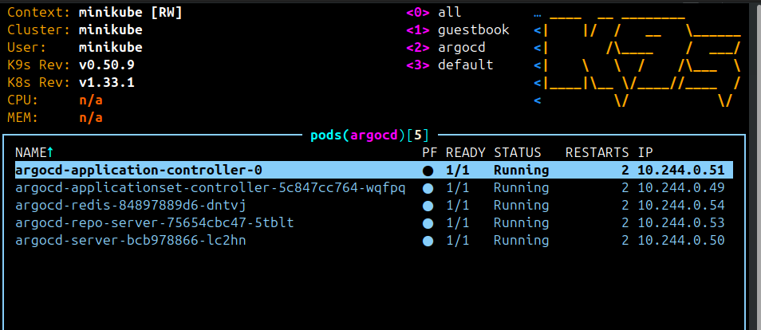

Access the ArgoCD UI by port-forwarding:

```bash
kubectl port-forward svc/argocd-server -n argocd 8080:443
```

Open your browser and go to `http://localhost:8080`.

Login with the default credentials:
- Username: `admin`
- Password: Get the password from the secret:
```bash
kubectl get secret argocd-initial-admin-secret -n argocd -o jsonpath="{.data.password}" | base64 -d; echo
```

Now you can see the ArgoCD dashboard. It’s empty, but we’ll fill it up soon.
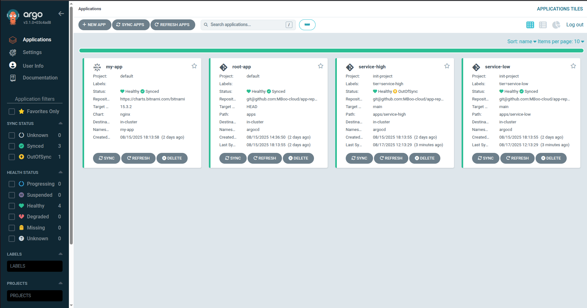


## 5. Setup Git Repository
Let’s make a repo structure that scales.
We’ll have one root `ApplicationSet that controls multiple apps across environments.

```bash
gitops-repo/
├── applicationset.yaml   # the boss
├── dev/
│   ├── app/              # your application manifests
│   └── addons/           # infra stuff like logging, ingress
├── test/
│   ├── app/
│   └── addons/
└── prod/
    ├── app/
    └── addons/
```

Create a new Git repository (e.g., on GitHub, GitLab, etc.) and push this structure to it.

## 6. Create the `ApplicationSet`

Now let’s bring in the real magic: **ApplicationSet**.  
This single config will look at your repo folders (dev, test, prod) and create Applications for each one automatically.  
With this setup, you can just add .yaml file to the respective folder, and it will be picked up by ArgoCD.

```yaml
apiVersion: argoproj.io/v1alpha1
kind: ApplicationSet
metadata:
  name: root-application
  namespace: argocd
spec:
  goTemplate: true
  generators:
    - git:
        repoURL: <your-git-repo-url>  # e.g.,
        revision: main
        directories:
          - path: dev
          - path: test
          - path: prod
  template:
    metadata:
      name: '{{ .path.basename }}'                 
      labels:
        tier: '{{ .path.basename }}'
    spec:
      project: default
      destination:
        server: https://kubernetes.default.svc
        namespace: argocd                          # because child is an Application manifest
      source:
        repoURL: git@github.com:MBoo-cloud/app-repo.git 
        targetRevision: main
        path: '{{ .path.path }}'                   # apps/hight or apps/low
        directory:
          recurse: true # Read all files in the directory
```

Apply it:
```bash
kubectl apply -f applicationset.yaml -n argocd

OUTPUT:
applicationset.argoproj.io/root-application created
```

Now, head back to the ArgoCD UI. You should see your ApplicationSet listed there.

If your **repository is private**, make sure to set up SSH keys or access tokens in ArgoCD project settings.

Access `https://localhost:8080/settings/repos?addRepo=true` to add your repository.
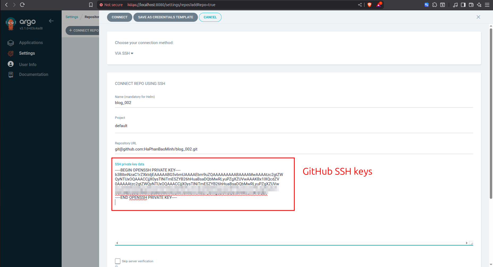

Check your `argocd-applicationset-controller` log:
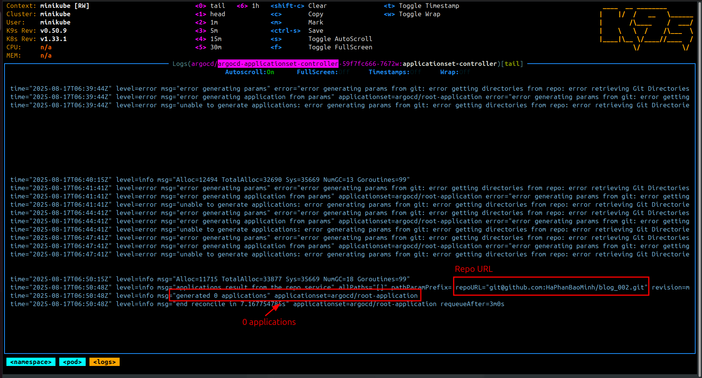

Because we not set up any Application yet, so it will not show anything in the ArgoCD UI and in the `argocd-applicationset-controller` log.

## 7. Create an Application 
Now, let’s create a simple Application manifest in the `dev` folder.
Create a file `dev/addons/nginx-app.yaml` with the following content:

```yaml
 apiVersion: argoproj.io/v1alpha1
kind: Application
metadata:
  name: nginx-app-dev
  namespace: argocd
spec:
  project: default
  source:
    repoURL: https://charts.bitnami.com/bitnami
    chart: nginx
    targetRevision: 15.3.2          # Chart version
    helm:
      values: |
        service:
          type: ClusterIP
        replicaCount: 1
  destination:
    server: https://kubernetes.default.svc
    namespace: dev
  syncPolicy:
    automated:
      prune: true
      selfHeal: true
    syncOptions:
      - CreateNamespace=true
```

Push this file to your Git repository.
```bash
.
├── applicationset.yaml
├── dev
│   ├── addons
│   │   └── nginx-app.yaml
│   └── app
├── prod
│   ├── addons
│   └── app
├── README.md
└── test
    ├── addons
    └── app
```

You can check log of `argocd-applicationset-controller` and ArgoCD UI to see if it created the Application for you.
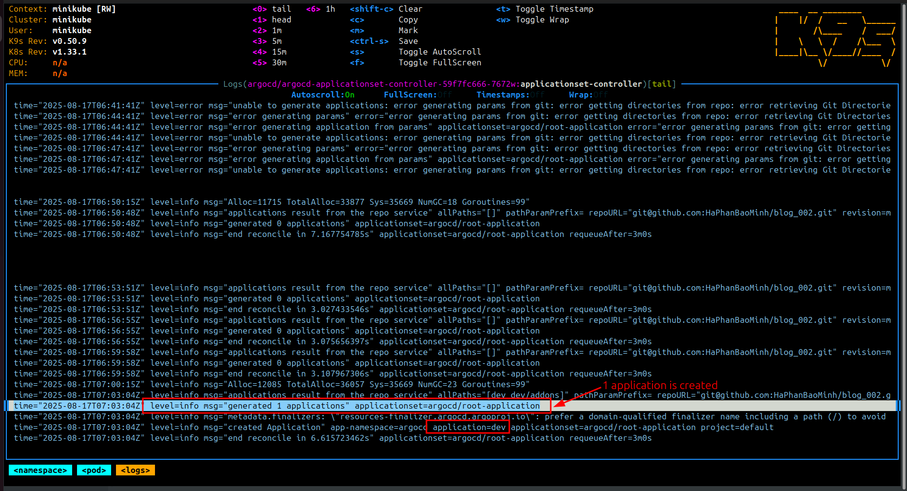
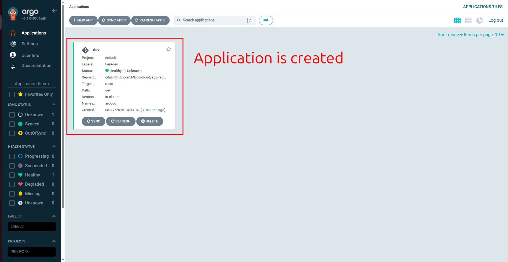
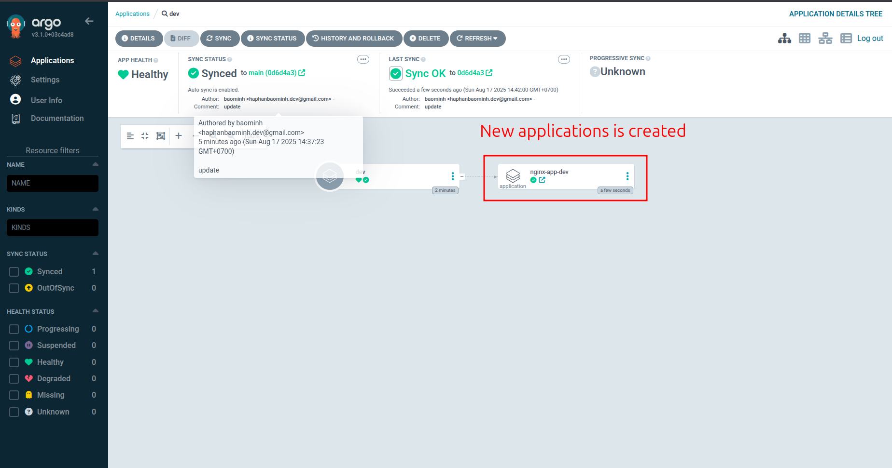

Great! Now you have an Application created but we dont need any `kubectl apply` anything.

You can create more Applications in the `test` and `prod` folders, and they will be automatically picked up by the `ApplicationSet`.

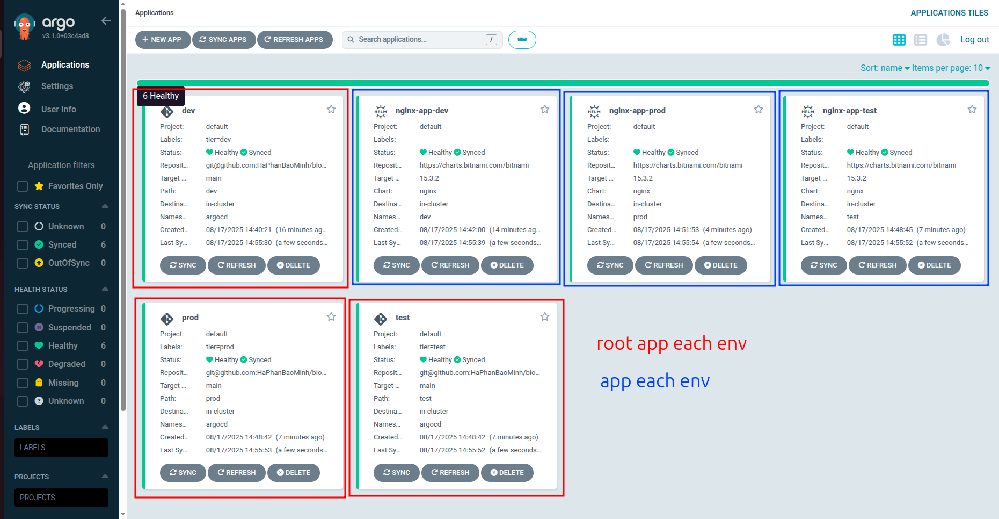
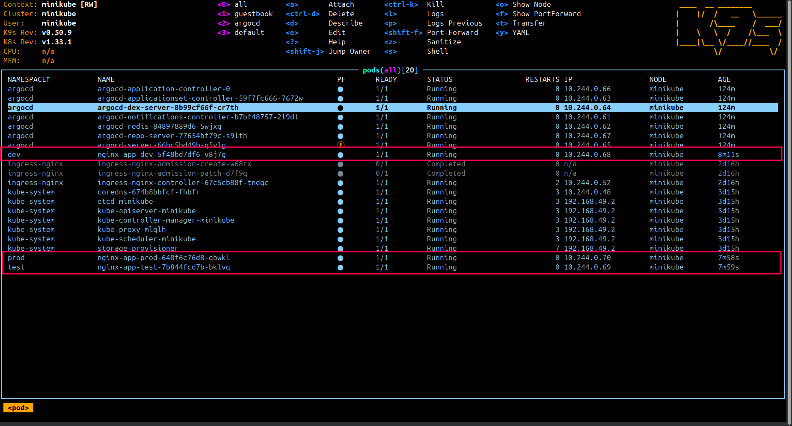

## 8. When Prod is on Fire 🔥 (Rollback to the Rescue)

So imagine this:  
You pushed a new commit, ArgoCD syncs it, and suddenly **prod goes down**.  
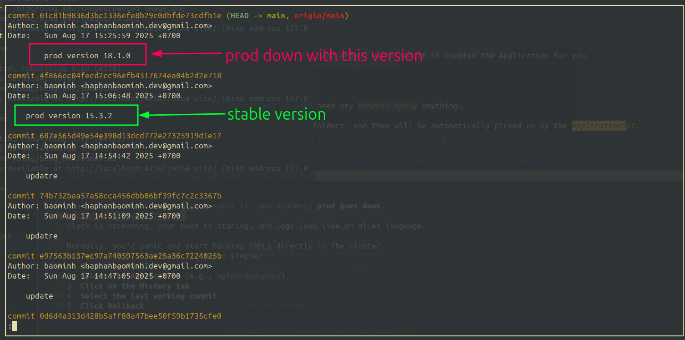
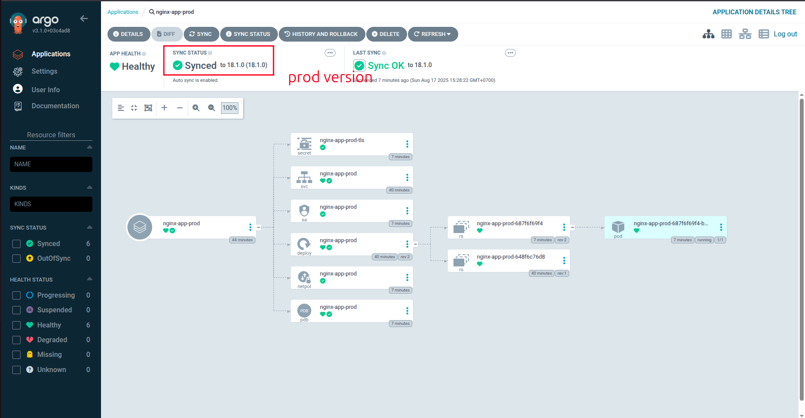
Slack is screaming, your boss is staring, and logs look like an alien language.  

Normally, you’d panic and start hacking YAMLs directly in the cluster.  
But with GitOps, you can **rollback** to the last known good state in seconds.
1. **Go to ArgoCD UI**.
2. **Select the Application** (e.g., `nginx-app-prod`).
3. **Click on the History tab**.
4. **Select the last working commit**.
5. **Click Rollback**.

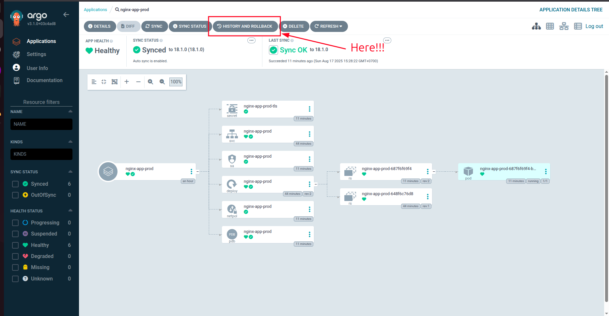
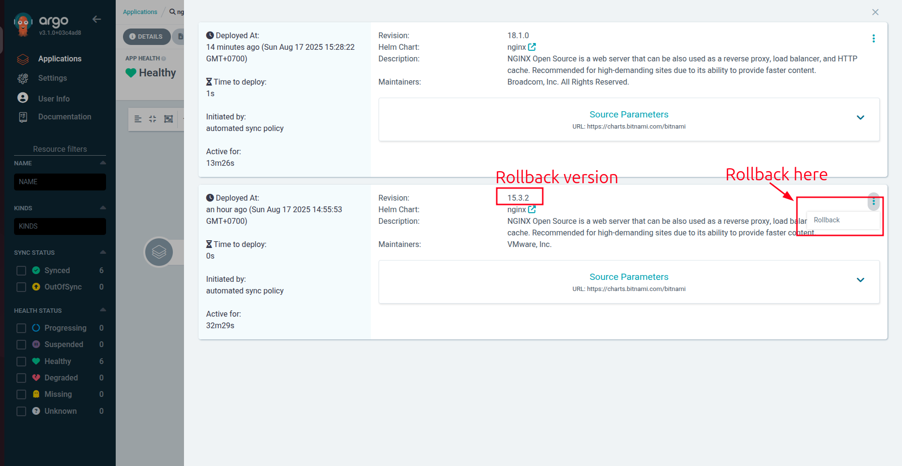
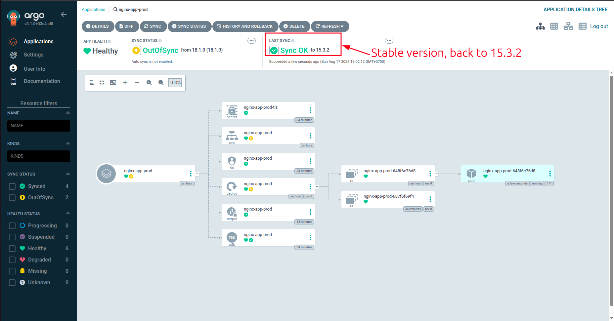

And just like that, you’re back in business. No more panic, no more chaos.

## 9. Wrapping It All Up 

Let’s take a step back and see what we actually built together:  

- We started with **minikube** as a safe playground.  
- We saw the pain of **manual kubectl apply** → chaos, drift, and bosses sighing behind our backs.  
- We introduced **GitOps**: Git as the source of truth, clusters as dumb executors.  
- We installed **ArgoCD** and set up a clean **ApplicationSet** structure for `dev`, `test`, and `prod`.  
- We deployed our first app (`nginx`) into `dev` — without touching `kubectl apply` again.  
- We showed how **prod rollbacks** become as easy as clicking a button.  

### Final Thought 


With ArgoCD + GitOps, you stop worrying about *how* to deploy and focus on *what* to build.  

Next time your boss asks:  
> “What’s running in prod right now?”  

You just point to the Git repo and the ArgoCD UI, smile, and say:  
> “Exactly what’s in Git, boss.” 

Now go grab that coffee ☕ — you’ve earned it.  

