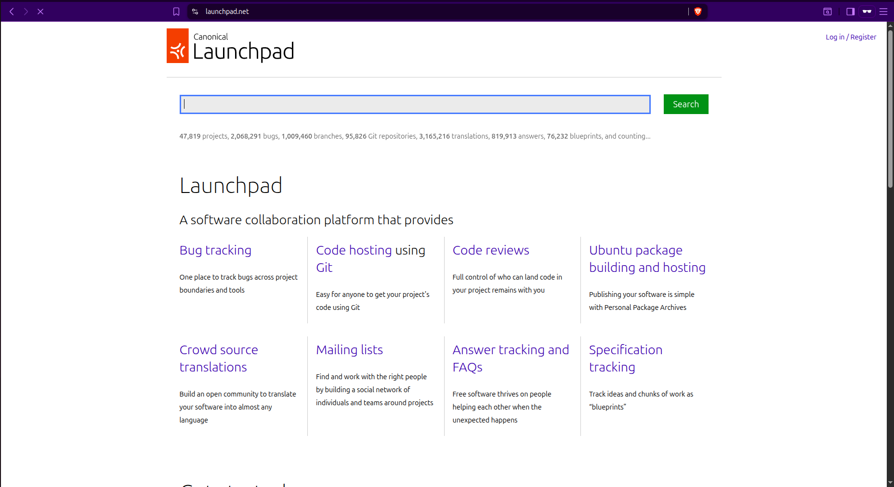
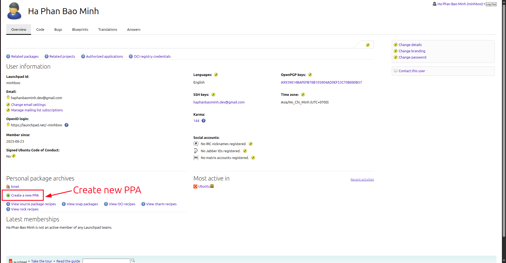
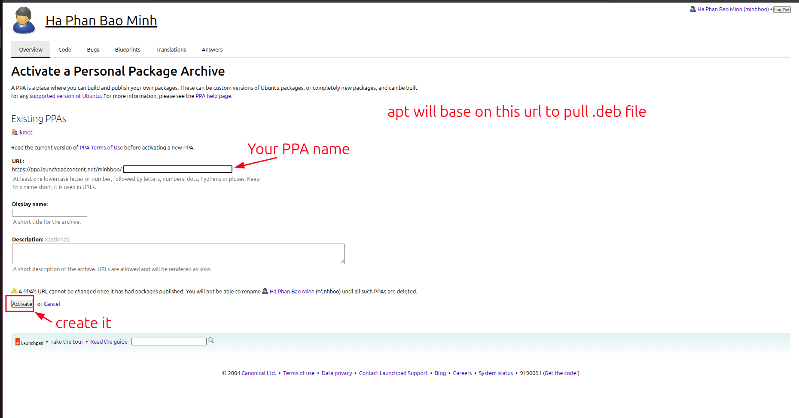
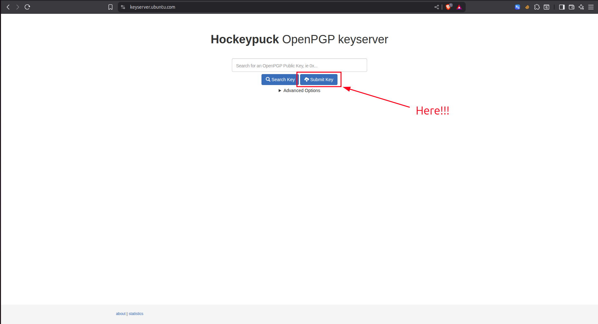
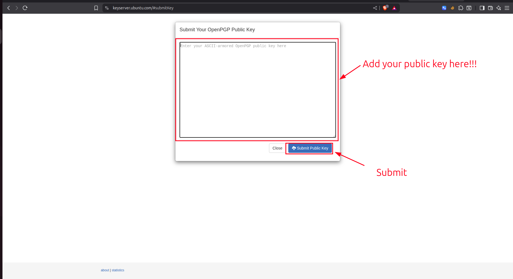
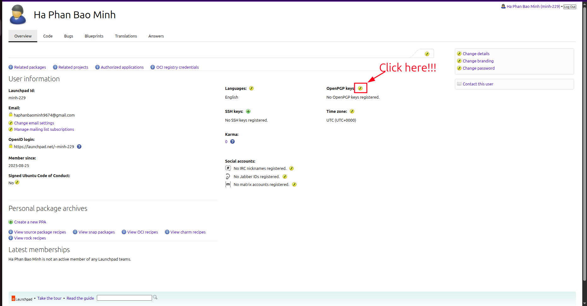

## 1. Why should you care?

You’ve built an awesome app — and now you want people to actually use it.
But sharing source code or `.deb` files is inconvenient.

Wouldn’t it be better if anyone could just type:
```bash
sudo apt install awesome-app
```
Publishing your app with `apt` makes that possible.

## 2. Overview

### 2.1 How `apt install` work ?

When you run:
```bash
sudo apt install awesome-app
```

`apt` does a few things behind the scenes:

1. Reads your sources list
    - It looks at all repositories in `/etc/apt/sources.list` and `/etc/apt/sources.list.d/`.
    - If you added a `PPA`, it’s included here.
2. Fetches the package index
    - From each repo, apt downloads a list of available packages (Packages file).
    - This is why you need `sudo apt update` before installing.
3. Resolves dependencies
    - `apt` checks what your app depends on and ensures all are installed.
4. Downloads the `.deb`
    - The actual `.deb` binary package is pulled from the repo.
5. Installs and configures
    - `dpkg` unpacks the `.deb`.
    - Post-install scripts (if any) run to configure your app.

So when users type `apt install awesome-app`, they’re really pulling a .deb that you’ve already published in a repository — in our case, Launchpad will host that repo for you.

### 2.2 What you need to publish your app

Before `apt` can deliver your app to the world, you need to prepare a few things:
1. **Your application source code**  
   - Could be written in Go, Python, Rust, C… anything.  
   - What matters is: you can build it into a binary or script that runs on Ubuntu.

2. **Debian packaging (`debian/` folder)**  
   - This is how Ubuntu knows how to build, describe, and install your app.  
   - Key files include:  
     - `control` → package metadata (name, description, dependencies).  
     - `changelog` → version history, target Ubuntu release (e.g. *noble*).  
     - `rules` → instructions to build the app.  
     - `source/format` → usually `3.0 (quilt)`.

3. **GPG key**  
   - Needed to sign your uploads.  
   - Launchpad requires this so it can trust you as the publisher.

4. **A PPA on Launchpad**  
   - Stands for *Personal Package Archive*.  
   - Launchpad hosts it for you, for free.  
   - Once you upload a source package, Launchpad builds it into `.deb` files.

5. **dput (upload tool)**  
   - This is the CLI tool you’ll use to send your source package to Launchpad.

## 3. Step by step guide

### 3.1. Create your PPA

A **PPA (Personal Package Archive)** is a personal software repository hosted on Launchpad.  
It lets you distribute `.deb` packages easily, so users can install your app with `apt`.

- Sign in at [Launchpad PPA](https://launchpad.net)


- Create your first PPA, you can this this like `Github` repositories


- Fill PPA information.


### 3.2. Create a `GPG` key and add it to Launchpad

Run this to create `GPG` key:
```bash
gpg --full-generate-key
gpg --list-keys
```

You can get `1 public key` and `1 private key`

Uploads `GPG` key to [Ubuntu keyserver](https://keyserver.ubuntu.com/) first



If everything fine, we can back to [Launchpad](https://launchpad.net/) to add `GPG`:


