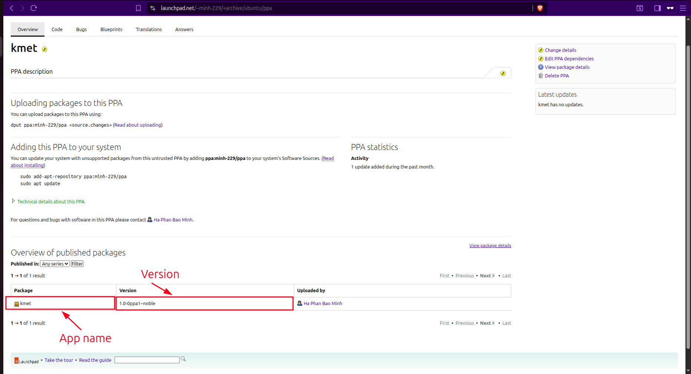
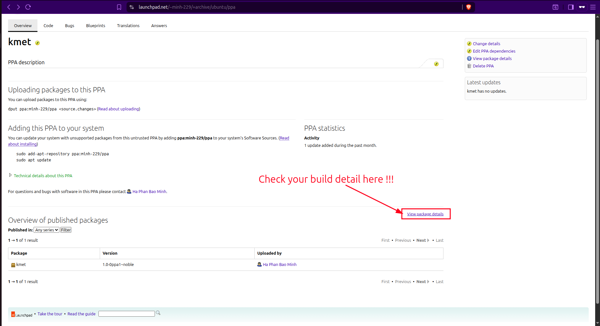
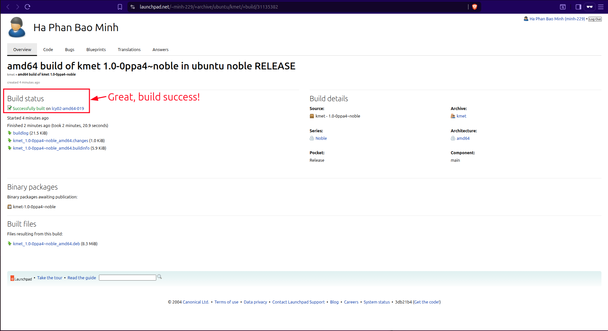
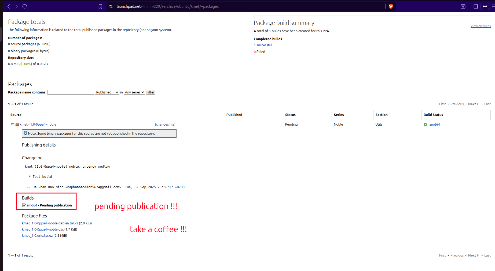
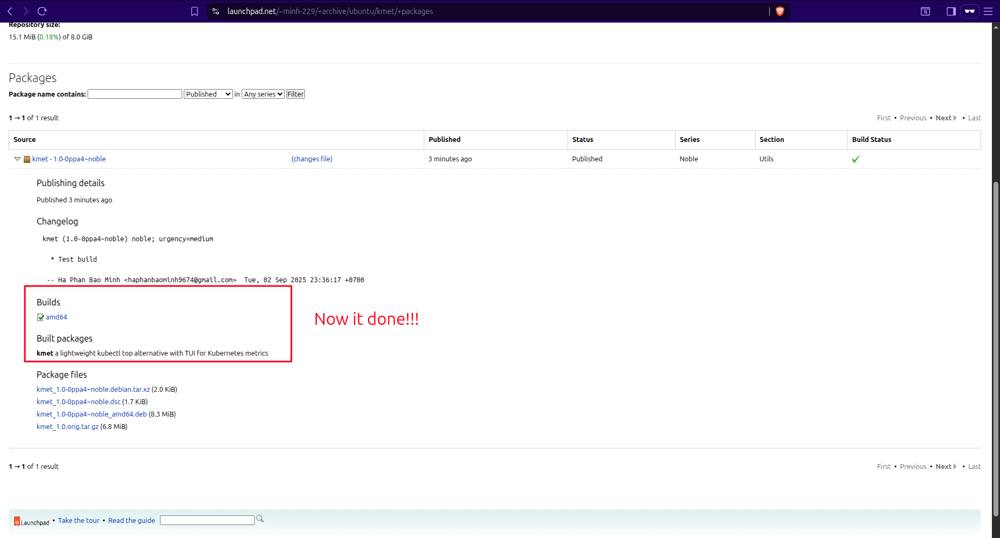
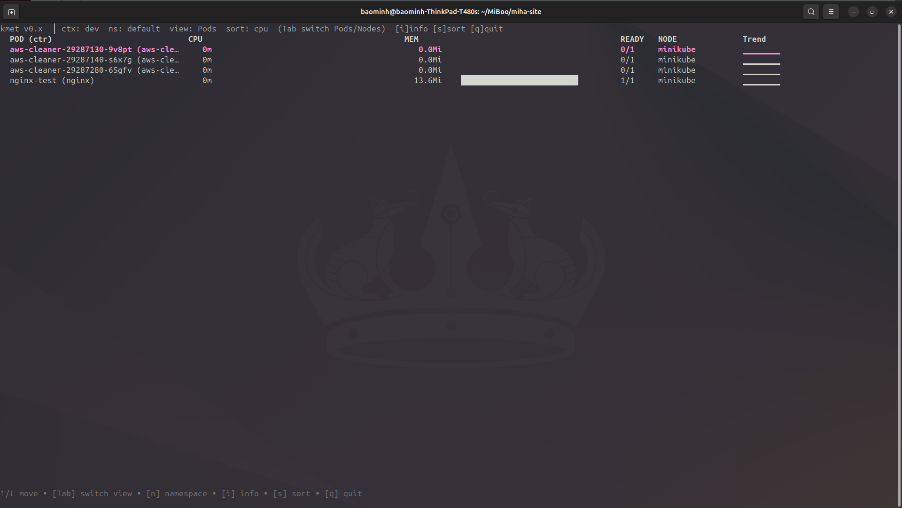

## 1. Why should you care?

Sharing `.deb` files is inconvenient and not scalable. With a PPA, users install your app simply with:

```bash
sudo apt install awesome-app
```
This works because your package is hosted in a trusted repository (Launchpad), and apt fetches it like any other Ubuntu package.

## 2. Overview

### 2.1 How `apt install` work ?

When you run:
```bash
sudo apt install awesome-app
```

`apt` does a few things behind the scenes:

1. Reads your sources list
    - It looks at all repositories in `/etc/apt/sources.list` and `/etc/apt/sources.list.d/`.
    - If you added a `PPA`, it’s included here.
2. Fetches the package index
    - From each repo, apt downloads a list of available packages (Packages file).
    - This is why you need `sudo apt update` before installing.
3. Resolves dependencies
    - `apt` checks what your app depends on and ensures all are installed.
4. Downloads the `.deb`
    - The actual `.deb` binary package is pulled from the repo.
5. Installs and configures
    - `dpkg` unpacks the `.deb`.
    - Post-install scripts (if any) run to configure your app.

So when users type `apt install awesome-app`, they’re really pulling a .deb that you’ve already published in a repository — in our case, Launchpad will host that repo for you.

### 2.2 What you need to publish your app

Before `apt` can deliver your app to the world, you need to prepare a few things:
1. **Your application source code**  
   - Could be written in Go, Python, Rust, C… anything.  
   - What matters is: you can build it into a binary or script that runs on Ubuntu.

2. **Debian packaging (`debian/` folder)**  
   - This is how Ubuntu knows how to build, describe, and install your app.  
   - Key files include:  
     - `control` → package metadata (name, description, dependencies).  
     - `changelog` → version history, target Ubuntu release (e.g. *noble*).  
     - `rules` → instructions to build the app.  
     - `source/format` → usually `3.0 (quilt)`.

3. **GPG key**  
   - Needed to sign your uploads.  
   - Launchpad requires this so it can trust you as the publisher.

4. **A PPA on Launchpad**  
   - Stands for *Personal Package Archive*.  
   - Launchpad hosts it for you, for free.  
   - Once you upload a source package, Launchpad builds it into `.deb` files.

5. **dput (upload tool)**  
   - This is the CLI tool you’ll use to send your source package to Launchpad.

## 3. Step by step guide

### 3.1. Create your PPA

A **PPA (Personal Package Archive)** is a personal software repository hosted on Launchpad.  
It lets you distribute `.deb` packages easily, so users can install your app with `apt`.

- Sign in at [Launchpad PPA](https://launchpad.net)


- Create your first PPA, you can thing this like `Github` repositories


- Fill PPA information.


### 3.2. Create a `GPG` key and add it to Launchpad

Run this to create `GPG` key:
```bash
gpg --full-generate-key

OUTPUT:
gpg (GnuPG) 2.4.4; Copyright (C) 2024 g10 Code GmbH
This is free software: you are free to change and redistribute it.
There is NO WARRANTY, to the extent permitted by law.

Please select what kind of key you want:
   (1) RSA and RSA
   (2) DSA and Elgamal
   (3) DSA (sign only)
   (4) RSA (sign only)
   (9) ECC (sign and encrypt) *default*
  (10) ECC (sign only)
  (14) Existing key from card
Your selection? 
```
- Choose (1) RSA and RSA.
- When asked for key size → enter 4096.
- When asked for expiration → you can set 0 (no expiration) or specify a duration (e.g., 2 years).
- Enter your PPA Launchpad Id, email

```bash 
OUTPUT:
public and secret key created and signed.

pub   rsa4096 2025-09-02 [SC]
      4F87F78EAF7CDBA041208659EA6BEB6A320399ED
uid                      minh-229 (N/A) <haphanbaominh9674@gmail.com>
sub   rsa4096 2025-09-02 [E]
```

You can get `1 public key` and `1 private key`
```bash 
# Public key 
gpg --armor --export 4F87F78EAF7CDBA041208659EA6BEB6A320399ED > public.key.asc

# Private key
gpg --armor --export-secret-keys 4F87F78EAF7CDBA041208659EA6BEB6A320399ED > private.key.asc
```

First uploads `GPG` key to [Ubuntu keyserver](https://keyserver.ubuntu.com/)


If everything fine, we can back to [Launchpad](https://launchpad.net/) to add `GPG`:


Import your public `GPG` key:


Save the entire section from -----BEGIN PGP MESSAGE----- to -----END PGP MESSAGE----- into a file:
```bash 
nano launchpad-msg.asc
```
Use GPG to decrypt:
```bash 
gpg --decrypt launchpad-msg.asc

OUTPUT:
Please go here to finish adding the key to your Launchpad account:

    <confirm-link>
```

Enter the link and confirm that 


Now you can see your `public key` in home page and make sure keep your `private key` in safe area: 


### 3.3. Prepare Debian packaging

Ok your `PPA` is ready, now we need setup your application repo
Ubuntu requires a `debian/` folder inside your project to know how to build and install your app.

You can refer to the setup in my repository: [kmet](https://github.com/HaPhanBaoMinh/kmet) 

Minimal structure looks like this:
```bash
debian/
├── changelog
├── compat
├── control
├── copyright
├── rules
└── source/format
```
- `changelog` – version history and target Ubuntu release.
- `compat` – debhelper compatibility level.
- `control` – package metadata: name, maintainer, dependencies, description.
- `copyright` – license and copyright info.
- `rules` – build instructions (like a Makefile).
- `source/format` – source package format, usually 3.0 (quilt).

`control` file:
```bash 
Source: awesome-app
Section: utils
Priority: optional
Maintainer: Your Name <you@example.com>
Build-Depends: debhelper-compat (= 13), golang-any
Standards-Version: 4.6.2
Homepage: https://github.com/yourname/awesome-app

Package: awesome-app
Architecture: any
Depends: ${shlibs:Depends}, ${misc:Depends}
Description: Awesome CLI tool
 A simple command-line tool that performs awesome tasks.
 This extended description provides more details about
 what the tool does, how it can be used, and why it is
 useful. Each paragraph should be indented by one space.
```

`changelog` file:
Instead of writing manually, use dch (Debian ChangeLog Helper) from the devscripts package.

Install the tool:
```bash
sudo apt install devscripts
```

Create a new changelog:
```bash
dch --create --package kmet -v 1.0-0ppa1~noble -D noble -u medium "PPA build for noble."
```
`1.0-0ppa1~noble` follows `Debian/Ubuntu` versioning rules:
- 1.0 → Upstream version of your application (your own release).
- -0 → Debian revision. 0 means this package is not part of official Debian/Ubuntu but built externally.
- ppa1 → Indicates this is the first build you upload to your PPA. If you upload fixes, increase it to ppa2, ppa3, etc.
- ~noble → Target Ubuntu release. The tilde (~) ensures that when Ubuntu releases an official 1.0-1 package, it will sort as newer than your PPA build.

Example generated entry - `changelog` file
```bash
awesome-app (1.0-0ppa4~noble) noble; urgency=medium

  * Initial release 

 -- Your Name <you@example.com>  Tue, 02 Sep 2025 10:00:00 +0700
```

`rules` file:  
This file defines how your package is built and installed. For Go applications, you often need to customize it to ensure the binary is compiled correctly.  

Example `debian/rules` for a Go project:
```bash
#!/usr/bin/make -f
export DH_VERBOSE=1
export GO111MODULE=on
export GOFLAGS=-mod=vendor -buildvcs=false
export CGO_ENABLED=0
export GOCACHE=$(CURDIR)/.cache/go-build
export GOMODCACHE=$(CURDIR)/.cache/go-mod

%:
	dh $@

override_dh_auto_build:
	mkdir -p $(GOCACHE) $(GOMODCACHE)
	go build -v -trimpath -ldflags "-s -w" -o build/kmet ./cmd/kmet

override_dh_auto_install:
	install -D -m0755 build/kmet debian/kmet/usr/bin/kmet

override_dh_auto_test:
	true
```
- `DH_VERBOSE=1` → makes debhelper show detailed logs.
- `GO111MODULE=on, GOFLAGS, CGO_ENABLED=0` → Go environment variables for reproducible builds.
- `override_dh_auto_build` → custom build command (go build …).
- `override_dh_auto_install` → installs the binary into the correct path inside the package.
- `override_dh_auto_test` → disables tests (always returns true).

### 3.4. Build the source package

First, you need to package your source code and sign it with the GPG key you registered earlier
```bash
git archive --format=tar --prefix=kmet-1.0/ HEAD | gzip -9 > ../kmet_1.0.orig.tar.gz
```

> **Note:** The name kmet_1.0.orig.tar.gz must exactly match the upstream version defined in debian/changelog. 

> **kmet (2.3-0ppa1~noble) noble** => **kmet_2.3.orig.tar.gz**

Once your `debian/` folder is ready, you can build a **source package** that Launchpad accepts.  
From your project root, run:

```bash
dpkg-buildpackage -S -sa -<public-key>

# Example:
dpkg-buildpackage -S -sa -k64E5A07FCB51930AF20406182192582C7A4B3765 

OUTPUT:
dpkg-buildpackage: info: source package kmet
dpkg-buildpackage: info: source version 1.0-0ppa1~noble
dpkg-buildpackage: info: source distribution noble
dpkg-buildpackage: info: source changed by Ha Phan Bao Minh <haphanbaominh9674@gmail.com>
 dpkg-source --before-build .
dpkg-source: info: using options from kmet/debian/source/options: --extend-diff-ignore=(^|/)vendor/.*
 debian/rules clean
dh clean
dh: warning: LTO optimize is enable in buildflags. But cgo doesn't support it. LTO flags will be stripped in cgo.
   dh_auto_clean
dh_auto_clean: warning: LTO optimize is enable in buildflags. But cgo doesn't support it. LTO flags will be stripped in cgo.
   dh_clean
	rm -f debian/debhelper-build-stamp
	rm -rf debian/.debhelper/
	rm -f -- debian/kmet.substvars debian/files
	rm -fr -- debian/kmet/ debian/tmp/
	find .  \( \( \
		\( -path .\*/.git -o -path .\*/.svn -o -path .\*/.bzr -o -path .\*/.hg -o -path .\*/CVS -o -path .\*/.pc -o -path .\*/_darcs \) -prune -o -type f -a \
	        \( -name '#*#' -o -name '.*~' -o -name '*~' -o -name DEADJOE \
		 -o -name '*.orig' -o -name '*.rej' -o -name '*.bak' \
		 -o -name '.*.orig' -o -name .*.rej -o -name '.SUMS' \
		 -o -name TAGS -o \( -path '*/.deps/*' -a -name '*.P' \) \
		\) -exec rm -f {} + \) -o \
		\( -type d -a \( -name autom4te.cache -o -name __pycache__ \) -prune -exec rm -rf {} + \) \)
 dpkg-source -b .
dpkg-source: info: using options from kmet/debian/source/options: --extend-diff-ignore=(^|/)vendor/.*
dpkg-source: info: using source format '3.0 (quilt)'
dpkg-source: info: building kmet using existing ./kmet_1.0.orig.tar.gz
dpkg-source: info: building kmet in kmet_1.0-0ppa1~noble.debian.tar.xz
dpkg-source: info: building kmet in kmet_1.0-0ppa1~noble.dsc
 dpkg-genbuildinfo --build=source -O../kmet_1.0-0ppa1~noble_source.buildinfo
 dpkg-genchanges -sa --build=source -O../kmet_1.0-0ppa1~noble_source.changes
dpkg-genchanges: info: including full source code in upload
 dpkg-source --after-build .
dpkg-source: info: using options from kmet/debian/source/options: --extend-diff-ignore=(^|/)vendor/.*
dpkg-buildpackage: info: source-only upload (original source is included)
 signfile kmet_1.0-0ppa1~noble.dsc
 signfile kmet_1.0-0ppa1~noble_source.buildinfo
 signfile kmet_1.0-0ppa1~noble_source.changes
```

Your need to get file 
```bash 
ls ..
... <app_name>_<version>-0ppa1~noble_source.changes

# Example:
... kmet_1.0-0ppa1~noble_source.changes
```

Now, put your app
```bash
dput ppa:minh-229/ppa ../kmet_1.0-0ppa1~noble_source.changes

OUTPUT:
D: Splitting host argument out of  ppa:minh-229/ppa.
D: Setting host argument.
Checking signature on .changes
gpg: ../kmet_1.0-0ppa1~noble_source.changes: Valid signature from 2192582C7A4B3765
Checking signature on .dsc
gpg: ../kmet_1.0-0ppa1~noble.dsc: Valid signature from 2192582C7A4B3765
Package includes an .orig.tar.gz file although the debian revision suggests
that it might not be required. Multiple uploads of the .orig.tar.gz may be
rejected by the upload queue management software.
Uploading to ppa (via ftp to ppa.launchpad.net):
  Uploading kmet_1.0-0ppa1~noble.dsc: done.
  Uploading kmet_1.0.orig.tar.gz: 614done.      
  Uploading kmet_1.0-0ppa1~noble.debian.tar.xz: done.
  Uploading kmet_1.0-0ppa1~noble_source.buildinfo: done.
  Uploading kmet_1.0-0ppa1~noble_source.changes: done.
Successfully uploaded packages.
```

### 3.5. Check your PPA




Back to PPA, you can see build Successfully, but still need wait for publication, it need about 1 hour



### 3.6. Install your app via apt

```bash
sudo add-apt-repository ppa:minh-229/kmet
sudo apt update
sudo apt install kmet

OUTPUT:
1 upgraded, 0 newly installed, 0 to remove and 54 not upgraded.
Need to get 8,696 kB of archives.
After this operation, 0 B of additional disk space will be used.
Get:1 https://ppa.launchpadcontent.net/minh-229/kmet/ubuntu noble/main amd64 kmet amd64 1.0-0ppa4~noble [8,696 kB]
Fetched 8,696 kB in 60s (145 kB/s)                                                                                                                                                           
(Reading database ... 261261 files and directories currently installed.)
Preparing to unpack .../kmet_1.0-0ppa4~noble_amd64.deb ...
Unpacking kmet (1.0-0ppa4~noble) over (0.0.4-0ppa2~noble) ...
Setting up kmet (1.0-0ppa4~noble) ...
```


It work, I can access my app
