## 1. Why should you care?

You’ve built an awesome app — and now you want people to actually use it.
But sharing source code or `.deb` files is inconvenient.

Wouldn’t it be better if anyone could just type:
```bash
sudo apt install awesome-app
```
Publishing your app with `apt` makes that possible.

## 2. Overview

### 2.1 How `apt install` work ?

When you run:
```bash
sudo apt install awesome-app
```

`apt` does a few things behind the scenes:

1. Reads your sources list
    - It looks at all repositories in `/etc/apt/sources.list` and `/etc/apt/sources.list.d/`.
    - If you added a `PPA`, it’s included here.
2. Fetches the package index
    - From each repo, apt downloads a list of available packages (Packages file).
    - This is why you need `sudo apt update` before installing.
3. Resolves dependencies
    - `apt` checks what your app depends on and ensures all are installed.
4. Downloads the `.deb`
    - The actual `.deb` binary package is pulled from the repo.
5. Installs and configures
    - `dpkg` unpacks the `.deb`.
    - Post-install scripts (if any) run to configure your app.

So when users type `apt install awesome-app`, they’re really pulling a .deb that you’ve already published in a repository — in our case, Launchpad will host that repo for you.

### 2.2 What you need to publish your app

Before `apt` can deliver your app to the world, you need to prepare a few things:
1. **Your application source code**  
   - Could be written in Go, Python, Rust, C… anything.  
   - What matters is: you can build it into a binary or script that runs on Ubuntu.

2. **Debian packaging (`debian/` folder)**  
   - This is how Ubuntu knows how to build, describe, and install your app.  
   - Key files include:  
     - `control` → package metadata (name, description, dependencies).  
     - `changelog` → version history, target Ubuntu release (e.g. *noble*).  
     - `rules` → instructions to build the app.  
     - `source/format` → usually `3.0 (quilt)`.

3. **GPG key**  
   - Needed to sign your uploads.  
   - Launchpad requires this so it can trust you as the publisher.

4. **A PPA on Launchpad**  
   - Stands for *Personal Package Archive*.  
   - Launchpad hosts it for you, for free.  
   - Once you upload a source package, Launchpad builds it into `.deb` files.

5. **dput (upload tool)**  
   - This is the CLI tool you’ll use to send your source package to Launchpad.

## 3. Step by step guide

### 3.1. Create your PPA

A **PPA (Personal Package Archive)** is a personal software repository hosted on Launchpad.  
It lets you distribute `.deb` packages easily, so users can install your app with `apt`.

- Sign in at [Launchpad PPA](https://launchpad.net)
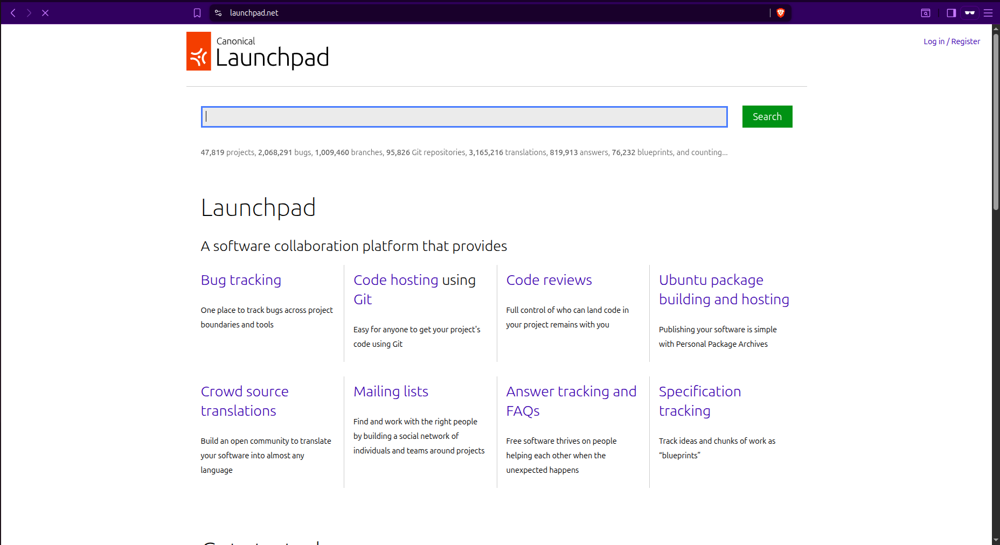

- Create your first PPA, you can thing this like `Github` repositories
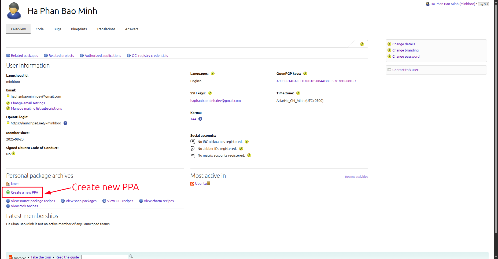

- Fill PPA information.
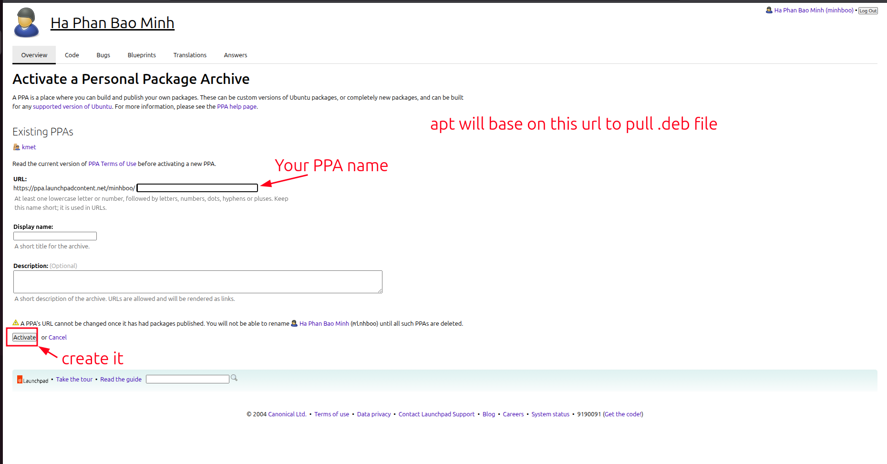

### 3.2. Create a `GPG` key and add it to Launchpad

Run this to create `GPG` key:
```bash
gpg --full-generate-key

OUTPUT:
gpg (GnuPG) 2.4.4; Copyright (C) 2024 g10 Code GmbH
This is free software: you are free to change and redistribute it.
There is NO WARRANTY, to the extent permitted by law.

Please select what kind of key you want:
   (1) RSA and RSA
   (2) DSA and Elgamal
   (3) DSA (sign only)
   (4) RSA (sign only)
   (9) ECC (sign and encrypt) *default*
  (10) ECC (sign only)
  (14) Existing key from card
Your selection? 
```
- Choose (1) RSA and RSA.
- When asked for key size → enter 4096.
- When asked for expiration → you can set 0 (no expiration) or specify a duration (e.g., 2 years).
- Enter your PPA Launchpad Id, email

```bash 
OUTPUT:
public and secret key created and signed.

pub   rsa4096 2025-09-02 [SC]
      4F87F78EAF7CDBA041208659EA6BEB6A320399ED
uid                      minh-229 (N/A) <haphanbaominh9674@gmail.com>
sub   rsa4096 2025-09-02 [E]
```

You can get `1 public key` and `1 private key`
```bash 
# Public key 
gpg --armor --export 4F87F78EAF7CDBA041208659EA6BEB6A320399ED > public.key.asc

# Private key
gpg --armor --export-secret-keys 4F87F78EAF7CDBA041208659EA6BEB6A320399ED > private.key.asc
```

Uploads `GPG` key to [Ubuntu keyserver](https://keyserver.ubuntu.com/) first
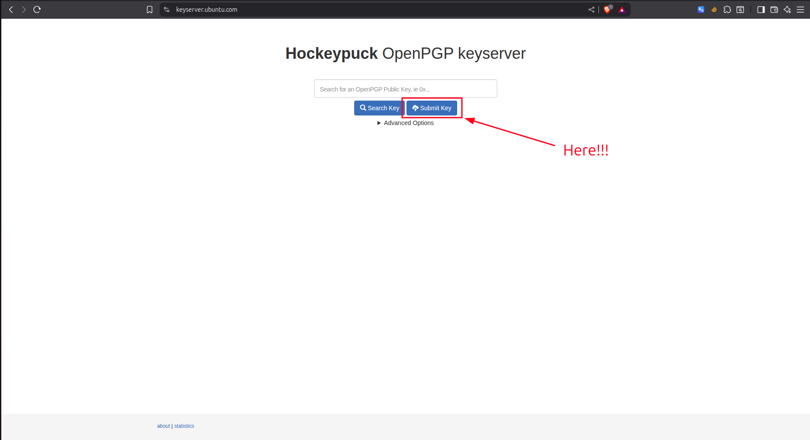
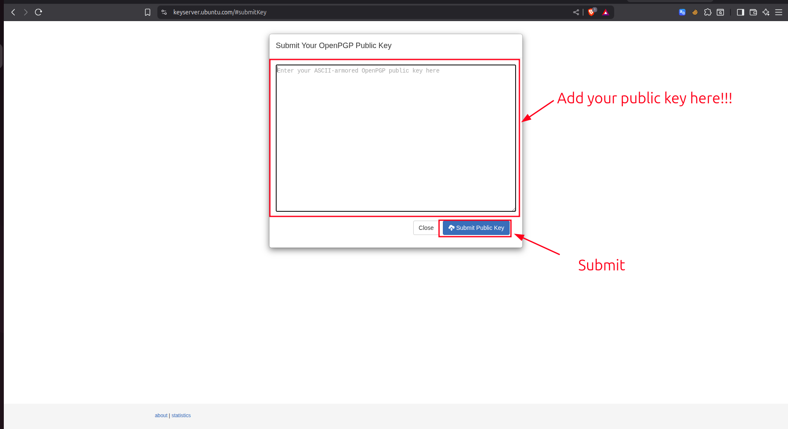
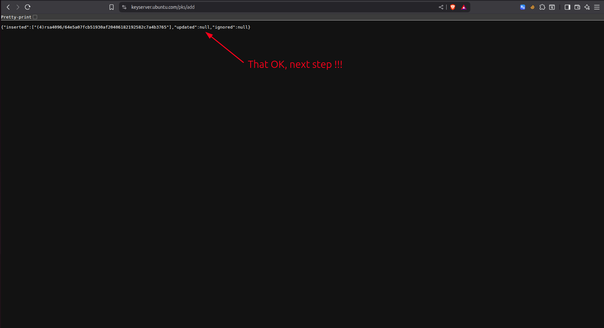

If everything fine, we can back to [Launchpad](https://launchpad.net/) to add `GPG`:
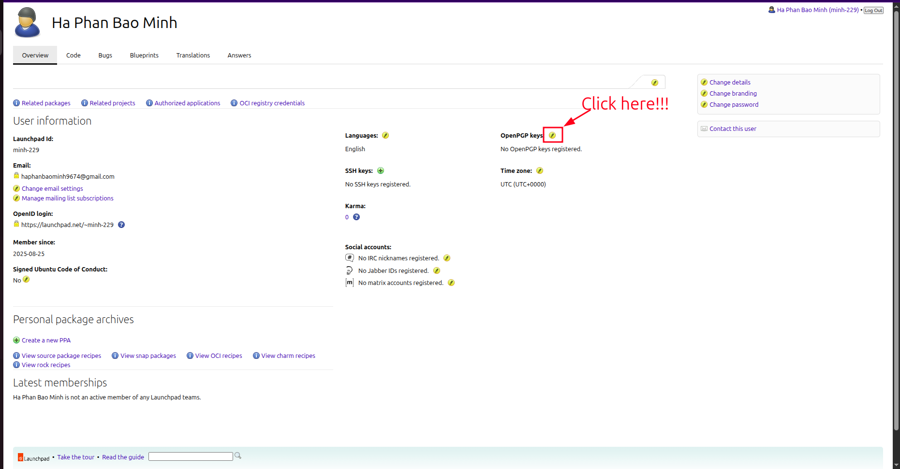

Import your public `GPG` key:
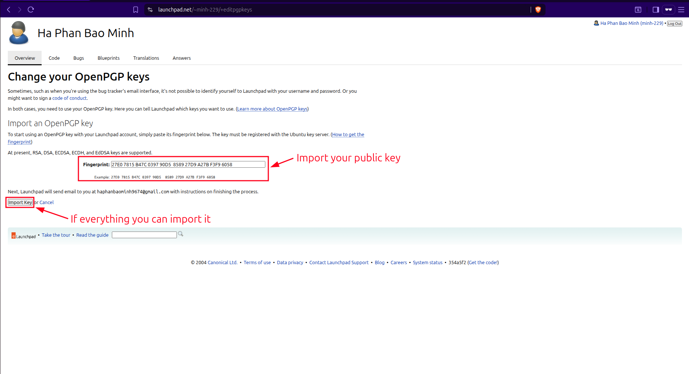

Now you can see your `public key` in home page and make sure keep your `private key` in safe area: 
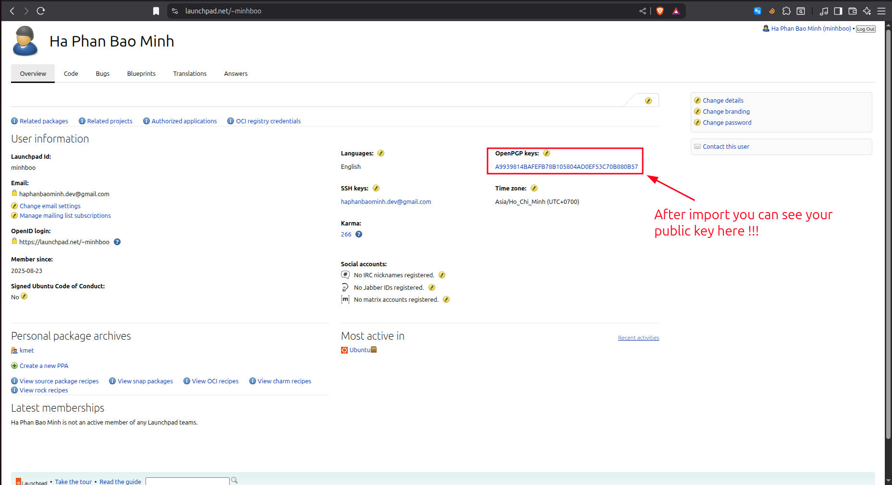
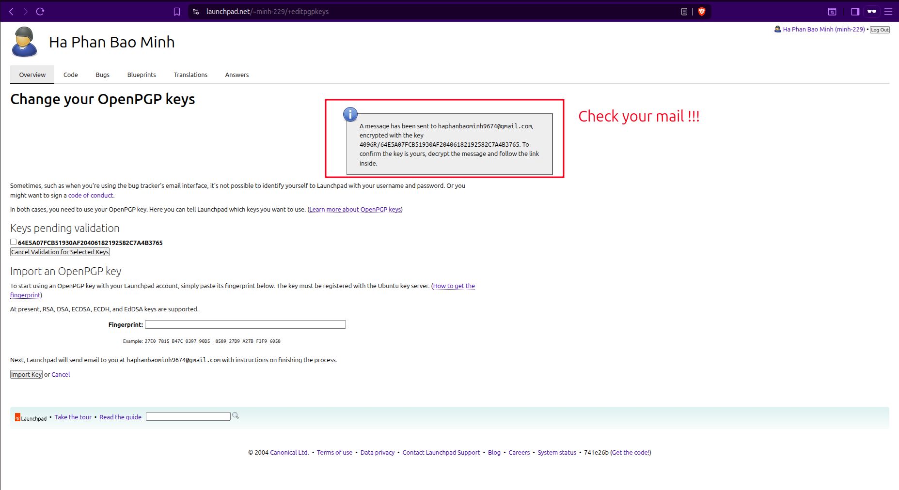
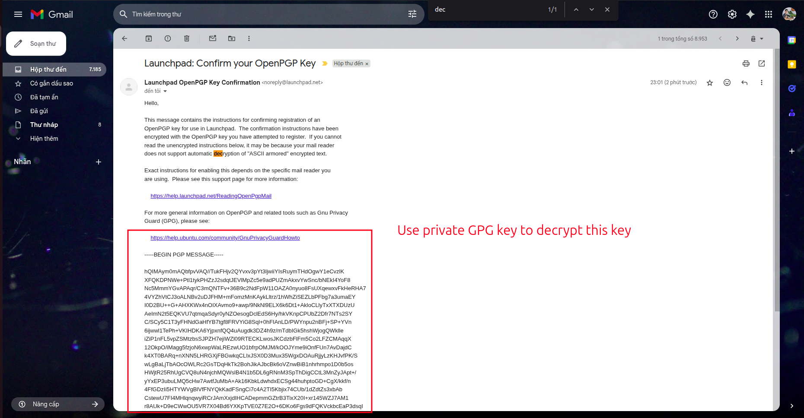
Save the entire section from -----BEGIN PGP MESSAGE----- to -----END PGP MESSAGE----- into a file:
```bash 
nano launchpad-msg.asc
```
Use GPG to decrypt:
```bash 
gpg --decrypt launchpad-msg.asc

OUTPUT:
Please go here to finish adding the key to your Launchpad account:

    <confirm-link>
```

Enter the link and confirm that 
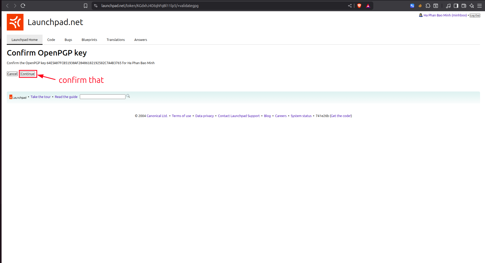
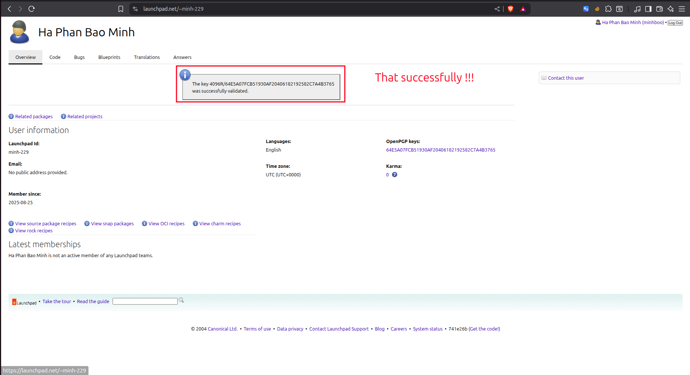

### 3.3. Prepare Debian packaging

Ok your `PPA` is ready, now we need setup your application repo
Ubuntu requires a `debian/` folder inside your project to know how to build and install your app.

You can refer to the setup in my repository: [kmet](https://github.com/HaPhanBaoMinh/kmet) 

Minimal structure looks like this:
```bash
debian/
├── changelog
├── compat
├── control
├── copyright
├── rules
└── source/format
```
- `changelog` – version history and target Ubuntu release.
- `compat` – debhelper compatibility level.
- `control` – package metadata: name, maintainer, dependencies, description.
- `copyright` – license and copyright info.
- `rules` – build instructions (like a Makefile).
- `source/format` – source package format, usually 3.0 (quilt).

`control` file:
```bash 
Source: awesome-app
Section: utils
Priority: optional
Maintainer: Your Name <you@example.com>
Build-Depends: debhelper-compat (= 13), golang-any
Standards-Version: 4.6.2
Homepage: https://github.com/yourname/awesome-app

Package: awesome-app
Architecture: any
Depends: ${shlibs:Depends}, ${misc:Depends}
Description: Awesome CLI tool
 A simple command-line tool that performs awesome tasks.
 This extended description provides more details about
 what the tool does, how it can be used, and why it is
 useful. Each paragraph should be indented by one space.
```

`changelog` file:
Instead of writing manually, use dch (Debian ChangeLog Helper) from the devscripts package.

Install the tool:
```bash
sudo apt install devscripts
```

Create a new changelog:
```bash
dch --create -v 1.0-0ubuntu1 --package awesome-app
```

Example generated entry - `changelog` file
```bash
awesome-app (1.0-0ubuntu1) noble; urgency=medium

  * Initial release 

 -- Your Name <you@example.com>  Tue, 02 Sep 2025 10:00:00 +0700
```

`rules` file:  
This file defines how your package is built and installed. For Go applications, you often need to customize it to ensure the binary is compiled correctly.  

Example `debian/rules` for a Go project:
```bash
#!/usr/bin/make -f
export DH_VERBOSE=1
export GO111MODULE=on
export GOFLAGS=-mod=vendor -buildvcs=false
export CGO_ENABLED=0

%:
	dh $@

override_dh_auto_build:
	go build -v -trimpath -ldflags "-s -w" -o build/kmet ./cmd/kmet

override_dh_auto_install:
	install -D -m0755 build/kmet debian/kmet/usr/bin/kmet

override_dh_auto_test:
	true
```
- `DH_VERBOSE=1` → makes debhelper show detailed logs.
- `GO111MODULE=on, GOFLAGS, CGO_ENABLED=0` → Go environment variables for reproducible builds.
- `override_dh_auto_build` → custom build command (go build …).
- `override_dh_auto_install` → installs the binary into the correct path inside the package.
- `override_dh_auto_test` → disables tests (always returns true).

### 3.4. Build the source package

First your need zip for source code:


Once your `debian/` folder is ready, you can build a **source package** that Launchpad accepts.  
From your project root, run:

```bash
dpkg-buildpackage -S -sa
```
