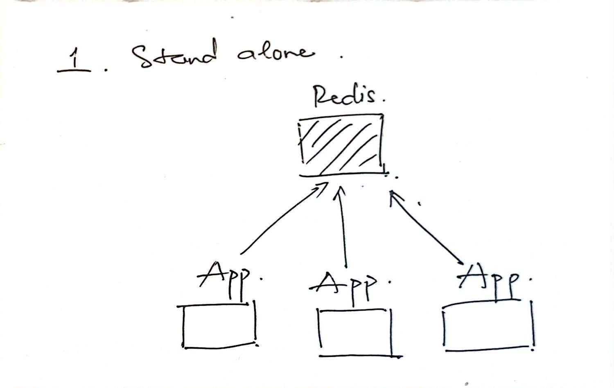
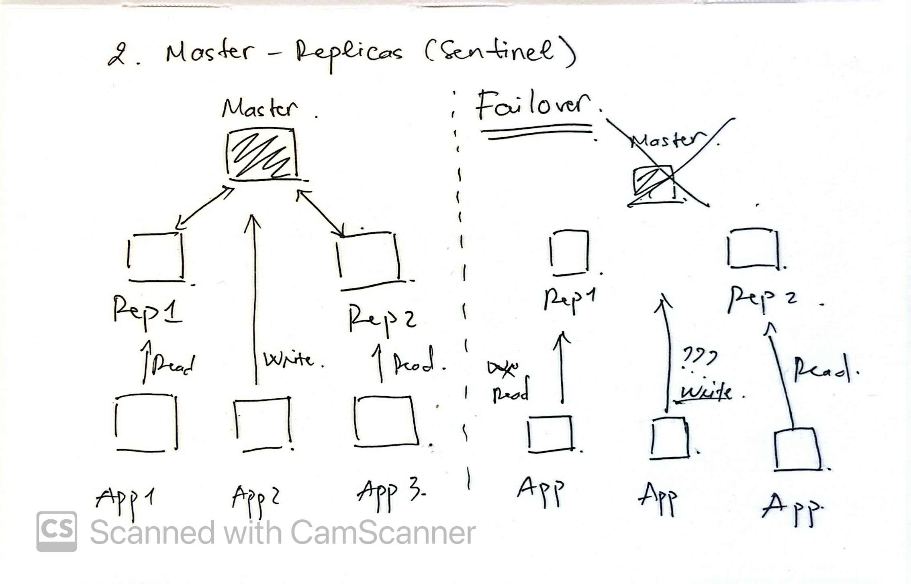
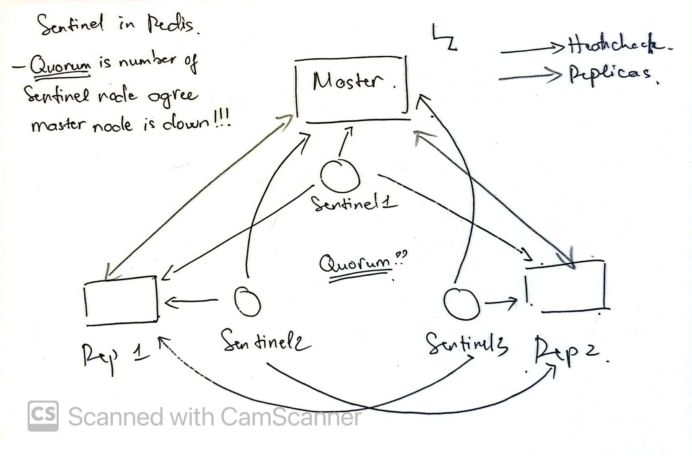
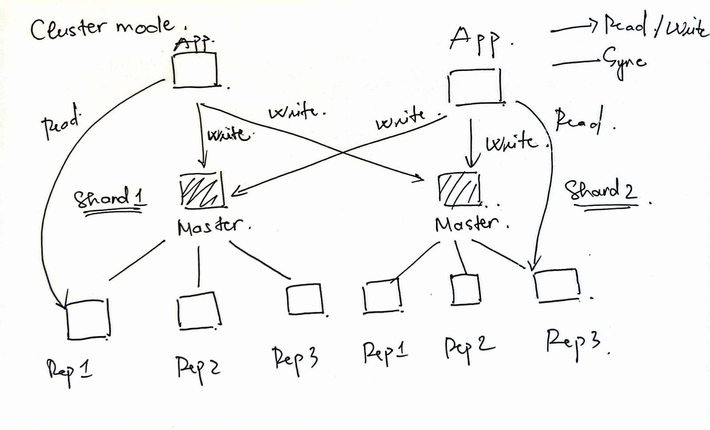

## 1. Why should you case ?

This article introduces the different ways to deploy Redis in its main modes (standalone, master-replica + Sentinel, cluster).

Redis is widely used today. This article simply shares the main deployment options and their trade-offs, to help you understand and choose what fits your needs.

## 2. Overview

Redis can run in several modes depending on your requirements:

- **Standalone**: a single node, simple but no high availability.  
- **Master-Replica with Sentinel**: one master, multiple replicas, monitored by Sentinel for failover.  
- **Cluster Mode**: multiple masters, each with replicas, data sharded across the cluster.

Each mode has its own strengths and weaknesses. In the next sections, we’ll look at how they work, when to use them, and how to deploy them in practice.

## 3. Standalone


### 3.1. Deployment
Run a single Redis node, usually with default configuration. Easiest way to start (e.g., `docker run redis:7-alpine`).

### 3.2. Pros
- Simple to set up and maintain  
- Low resource overhead  
- Good for development, testing, small workloads

### 3.3. Cons
- No High Availability (HA)  
- Single point of failure  
- Cannot scale reads or writes  

### 3.4. High Availability
Not supported. If the node crashes, Redis service is unavailable.

### 3.5. When to choose
- Development, testing, local experiments  
- Small workloads where downtime is acceptable  

### 3.6. Docker Compose
```yaml
version: "3.8"

services:
  redis:
    image: redis:7-alpine
    container_name: redis-standalone
    ports:
      - "6379:6379"
    command: ["redis-server", "--appendonly", "yes"]
```

---

## 4. Master-Replica with Sentinel 


### 4.1. Deployment
One master node handles writes, multiple replicas sync data asynchronously. Sentinel nodes monitor and trigger failover if the master goes down.

### 4.2. Pros
- Read scalability (replicas can serve read requests)  
- Automated failover with Sentinel  
- Relatively easy to add replicas  

### 4.3. Cons
- Writes still limited to one master  
- Asynchronous replication → risk of data loss on failover  
- More complex setup (Sentinel cluster required)  
- During failover, applications may not immediately know which node is the new master, unless they are Sentinel-aware or use a smart client. This can cause temporary write failures until reconnection logic handles the change.  

### 4.4. Sentinel?

Redis Sentinel is a built-in system that provides monitoring, notification, and automatic failover for a master-replica setup.

- **Monitoring**: Sentinel constantly checks if the master and replicas are reachable.  
- **Notification**: It can alert administrators or other services when a failure is detected.  
- **Automatic Failover**: If the master becomes unavailable, Sentinel promotes one of the replicas to master and reconfigures the others accordingly.  
- **Configuration Provider**: Applications can query Sentinel to always find the current master, instead of hard-coding its address.  

Sentinel Rules:
- Sentinel requires a **quorum (majority vote)** to decide on failover.  
- Quorum = the number of Sentinel nodes that agree the master is down.  
- In production, you should run at least **3 Sentinel nodes** to ensure a reliable majority and avoid false failover decisions.  

### 4.5. High Availability
Sentinel provides automatic promotion of replicas. Still possible to lose unreplicated writes.

### 4.6. When to choose
- Workloads with high read traffic  
- Systems where moderate downtime/data loss is acceptable  
- Mid-size production needing some level of HA  

### 4.7. Docker Compose
```yaml
version: '3'

services:
  redis-master:
    image: bitnamilegacy/redis:latest
    ports:
      - '6379:6379'
    environment:
      - REDIS_REPLICATION_MODE=master
      - ALLOW_EMPTY_PASSWORD=yes
      - REDIS_AOF_ENABLED=yes
    volumes:
      - redis-master-db:/bitnami/redis/data
    networks:
      redis-net:
        ipv4_address: 172.50.0.10

  redis-slave1:
    image: bitnamilegacy/redis:latest
    ports:
      - '6380:6379'
    environment:
      - REDIS_REPLICATION_MODE=slave
      - REDIS_MASTER_HOST=redis-master
      - REDIS_MASTER_PORT_NUMBER=6379
      - ALLOW_EMPTY_PASSWORD=yes
      - REDIS_AOF_ENABLED=yes
    volumes:
      - redis-slave1-db:/bitnami/redis/data
    networks:
      redis-net:
        ipv4_address: 172.50.0.11
    depends_on:
      - redis-master

  redis-slave2:
    image: bitnamilegacy/redis:latest
    ports:
      - '6381:6379'
    environment:
      - REDIS_REPLICATION_MODE=slave
      - REDIS_MASTER_HOST=redis-master
      - REDIS_MASTER_PORT_NUMBER=6379
      - ALLOW_EMPTY_PASSWORD=yes
      - REDIS_AOF_ENABLED=yes
    volumes:
      - redis-slave2-db:/bitnami/redis/data
    networks:
      redis-net:
        ipv4_address: 172.50.0.12
    depends_on:
      - redis-master

  redis-sentinel1:
    image: bitnamilegacy/redis-sentinel:latest
    ports:
      - '26379:26379'
    environment:
      - REDIS_MASTER_HOST=redis-master
      - REDIS_MASTER_PORT_NUMBER=6379
      - REDIS_SENTINEL_PORT_NUMBER=26379
    networks:
      redis-net:
        ipv4_address: 172.50.0.13
    depends_on:
      - redis-master
      - redis-slave1
      - redis-slave2

  redis-sentinel2:
    image: bitnamilegacy/redis-sentinel:latest
    ports:
      - '26380:26379'
    environment:
      - REDIS_MASTER_HOST=redis-master
      - REDIS_MASTER_PORT_NUMBER=6379
      - REDIS_SENTINEL_PORT_NUMBER=26380
    networks:
      redis-net:
        ipv4_address: 172.50.0.14
    depends_on:
      - redis-master
      - redis-slave1
      - redis-slave2

  redis-sentinel3:
    image: bitnamilegacy/redis-sentinel:latest
    ports:
      - '26381:26379'
    environment:
      - REDIS_MASTER_HOST=redis-master
      - REDIS_MASTER_PORT_NUMBER=6379
      - REDIS_SENTINEL_PORT_NUMBER=26381
    networks:
      redis-net:
        ipv4_address: 172.50.0.15
    depends_on:
      - redis-master
      - redis-slave1
      - redis-slave2

networks:
  redis-net:
    driver: bridge
    ipam:
      driver: default
      config:
        - subnet: 172.50.0.0/24

volumes:
  redis-master-db:
  redis-slave1-db:
  redis-slave2-db:
``` 

Check current master:
```bash
docker exec -it tmp-redis-sentinel3-1 redis-cli -p 26379 SENTINEL get-master-addr-by-name mymaster

# OUTPUT: 
1) "172.50.0.10"
2) "6379"
```

Check all docker containers ip: 
```bash 
docker ps -q | xargs docker inspect --format '{{.Name}}: {{range .NetworkSettings.Networks}}{{.IPAddress}}{{end}}'

# OUTPUT:
baominh@baominh-ThinkPad-T480s:/tmp$ docker ps -q | xargs docker inspect --format '{{.Name}}: {{range .NetworkSettings.Networks}}{{.IPAddress}}{{end}}'
/tmp-redis-sentinel3-1: 172.50.0.15
/tmp-redis-sentinel1-1: 172.50.0.13
/tmp-redis-sentinel2-1: 172.50.0.14
/tmp-redis-slave2-1: 172.50.0.12
/tmp-redis-slave1-1: 172.50.0.11
/tmp-redis-master-1: 172.50.0.10
```
As you can see, the current master is `tmp-redis-master-1` with IP `172.50.0.10`.

Write some data to master:
```bash
docker exec -it tmp-redis-master-1 redis-cli set key1 "hello world"
# OUTPUT: OK

docker exec -it tmp-redis-master-1 redis-cli get key1
# OUTPUT: "hello world"
```

Read from slave:
```bash
docker exec -it tmp-redis-slave1-1 redis-cli get key1
# OUTPUT: "hello world"
```

Test failover:
```bash
docker stop tmp-redis-master-1 
# Wait a few seconds for Sentinel to detect the failure and promote a new master 
```

Check new master:
```bash
docker exec -it tmp-redis-sentinel1-1 redis-cli -p 26379 SENTINEL get-master-addr-by-name mymaster 
# OUTPUT: 
1) "172.50.0.11"
2) "6379"

docker exec -it tmp-redis-sentinel3-1 redis-cli -p 26381 SENTINEL get-master-addr-by-name mymaster 
# OUTPUT: 
1) "172.50.0.11"
2) "6379"
``` 

You can see that now the new master is `tmp-redis-slave1-1` with IP `172.50.0.11`.

---

## 5. Cluster Mode 



### 5.1. Deployment 
Cluster with multiple masters, each managing a subset of hash slots. Each master usually has at least one replica for HA. If a master fails, its replica is promoted. Cluster mode allows both read and write scalability. 

- The key space is divided into **16,384 hash slots**.  
- Each master owns a subset of these slots for both reads and writes. 
- Clients can connect to any node, which will redirect requests to the appropriate master if needed.
- Each master typically has one or more replicas for high availability.

Example: We have 3 masters (M1, M2, M3)


### 5.2. Client redirection. 
**MOVED:** client asked the wrong node for a slot that lives elsewhere. Client must reconnect to the node in the error and cache the new mapping. This is a stable redirect. 
```bash 
redis-cli -p 7001 GET user:1
(error) MOVED 5793 127.0.0.1:7002
redis-cli -p 7002 GET user:1
"Bob"
```

**ASK:** client asked the wrong node for a slot that is currently being migrated to another node. Client must reconnect to the node in the error and issue an ASKING command before the original command. This is a temporary redirect. 
```bash
redis-cli -p 7001 GET user:1 
(error) ASK 5793 

redis-cli -p 7002 ASKING 
OK 
redis-cli -p 7002 GET user:1 
"Bob"
```

### 5.3. Pros
- Horizontal scaling for both reads and writes  
- Automatic sharding via 16,384 hash slots  
- Built-in replication and failover  
- No external Sentinel or proxy needed  
- High throughput for large datasets and distributed workloads  

### 5.4. Cons
- **Limited multi-key operations** → Only allowed if all keys belong to the same hash slot.  
```bash
user:1  → slot 5798
user:100 → slot 5793

redis-cli -p 7001 MGET user:1 user:100 
(error) CROSSSLOT Keys in request don't hash to the same slot 
# The multi-key operation fails because the keys are in different slots.
``` 
- **Cluster management complexity** → Node addition/removal requires slot rebalancing.  
- **Partial availability** → Write operations stop if majority of masters are down (split-brain protection).  
- **Client library awareness** → Applications must use **Cluster-aware clients** (e.g., `redis-py-cluster`, `ioredis`, `JedisCluster`).

### 5.5. Docker Compose
```yaml
version: '3.9'

services:
  redis-node-1:
    image: redis:7-alpine
    container_name: redis-node-1
    command: ["redis-server", "--cluster-enabled", "yes",
              "--cluster-config-file", "nodes.conf",
              "--cluster-node-timeout", "5000",
              "--appendonly", "yes"]
    ports:
      - "7001:6379"
    networks:
      redis-net:
        ipv4_address: 172.60.0.11

  redis-node-2:
    image: redis:7-alpine
    container_name: redis-node-2
    command: ["redis-server", "--cluster-enabled", "yes",
              "--cluster-config-file", "nodes.conf",
              "--cluster-node-timeout", "5000",
              "--appendonly", "yes"]
    ports:
      - "7002:6379"
    networks:
      redis-net:
        ipv4_address: 172.60.0.12

  redis-node-3:
    image: redis:7-alpine
    container_name: redis-node-3
    command: ["redis-server", "--cluster-enabled", "yes",
              "--cluster-config-file", "nodes.conf",
              "--cluster-node-timeout", "5000",
              "--appendonly", "yes"]
    ports:
      - "7003:6379"
    networks:
      redis-net:
        ipv4_address: 172.60.0.13

  redis-node-4:
    image: redis:7-alpine
    container_name: redis-node-4
    command: ["redis-server", "--cluster-enabled", "yes",
              "--cluster-config-file", "nodes.conf",
              "--cluster-node-timeout", "5000",
              "--appendonly", "yes"]
    ports:
      - "7004:6379"
    networks:
      redis-net:
        ipv4_address: 172.60.0.14

  redis-node-5:
    image: redis:7-alpine
    container_name: redis-node-5
    command: ["redis-server", "--cluster-enabled", "yes",
              "--cluster-config-file", "nodes.conf",
              "--cluster-node-timeout", "5000",
              "--appendonly", "yes"]
    ports:
      - "7005:6379"
    networks:
      redis-net:
        ipv4_address: 172.60.0.15

  redis-node-6:
    image: redis:7-alpine
    container_name: redis-node-6
    command: ["redis-server", "--cluster-enabled", "yes",
              "--cluster-config-file", "nodes.conf",
              "--cluster-node-timeout", "5000",
              "--appendonly", "yes"]
    ports:
      - "7006:6379"
    networks:
      redis-net:
        ipv4_address: 172.60.0.16

networks:
  redis-net:
    driver: bridge
    ipam:
      config:
        - subnet: 172.60.0.0/24
``` 

Create the cluster:
```bash
# Get all docker containers ip: 
docker ps -q | xargs docker inspect --format '{{.Name}}: {{range .NetworkSettings.Networks}}{{.IPAddress}}{{end}}'
# OUTPUT:
/redis-node-1: 172.60.0.11
/redis-node-3: 172.60.0.13
/redis-node-2: 172.60.0.12

docker exec -it redis-node-1 redis-cli --cluster create \
  172.60.0.11:6379 172.60.0.12:6379 172.60.0.13:6379 \
  172.60.0.14:6379 172.60.0.15:6379 172.60.0.16:6379 \
  --cluster-replicas 1
# Type 'yes' to confirm 
# OUTPUT:
>>> Performing hash slots allocation on 3 nodes...
Master[0] -> Slots 0 - 5460
Master[1] -> Slots 5461 - 10922
Master[2] -> Slots 10923 - 16383
...
[OK] All nodes agree about slots configuration.
>>> Check for open slots...
>>> Check slots coverage...
[OK] All 16384 slots covered.
```

Check cluster nodes:
```bash 
docker exec -it redis-node-1 redis-cli -p 6379 cluster info
docker exec -it redis-node-1 redis-cli -p 6379 cluster nodes
# OUTPUT: 
... 
cluster_state:ok
cluster_slots_assigned:16384
... 
```

Write some data:
```bash
docker exec -it redis-node-2 redis-cli -p 6379 SET user:10 "alice"
# OUTPUT: OK

docker exec -it redis-node-1 redis-cli -c -p 6379 GET user:10 
# OUTPUT: "Alice"
```

- Although written to node-2, the value is readable from any node. Redis Cluster routes requests by key slot, and redis-cli -c automatically follows redirects to the correct node.

- About failover, it works similarly to master-replica + Sentinel. If a master fails, its replica is promoted. The cluster remains available as long as a majority of masters are up. 

- But it cluster mode it don't have sentinel to monitor, it is built-in and health is checked via gossip protocol between nodes.

## 6. Conclusion

- Redis offers multiple deployment modes — from Standalone to Master-Replica + Sentinel to Cluster — each with their own trade-offs in availability, scalability, and complexity.

This article has covered the key deployment patterns I’ve explored. I hope it proves helpful as you navigate Redis in your projects. In upcoming posts, I will share detailed guides on migration strategies and monitoring Redis. Thank you for reading.

For feedback or inquiries, you can reach out via my homepage.

Sincerely.
