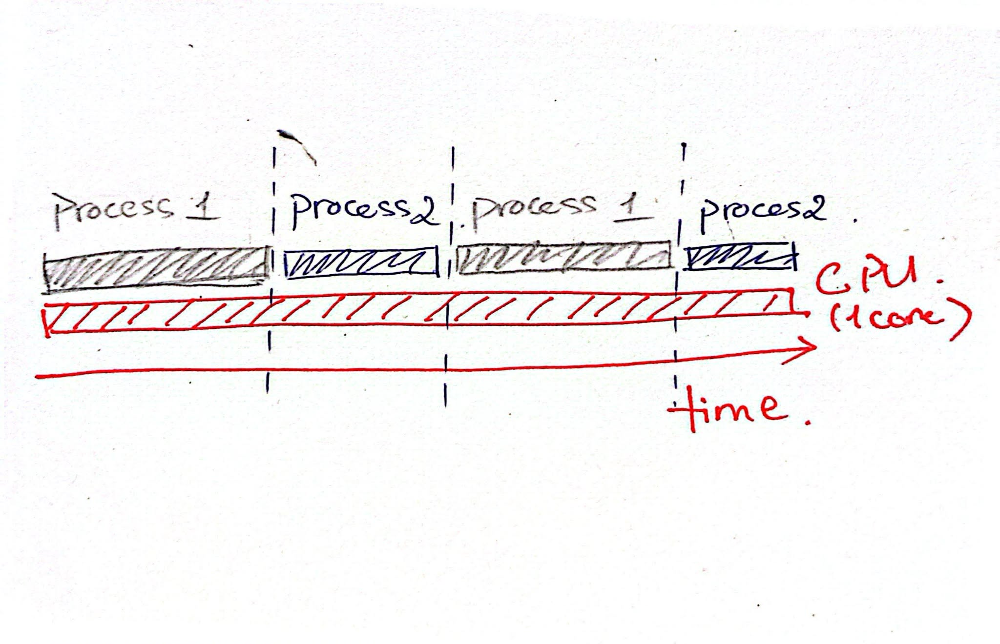
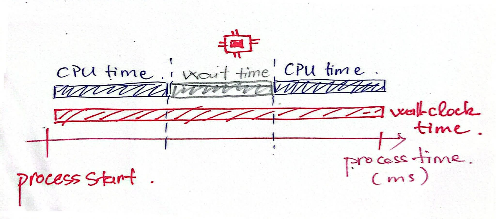
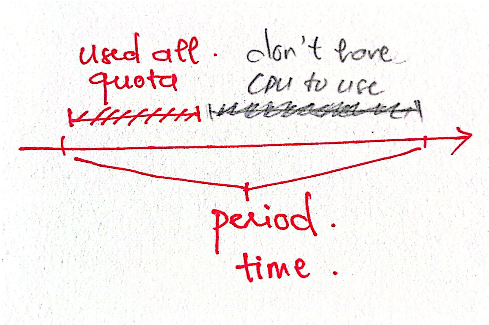
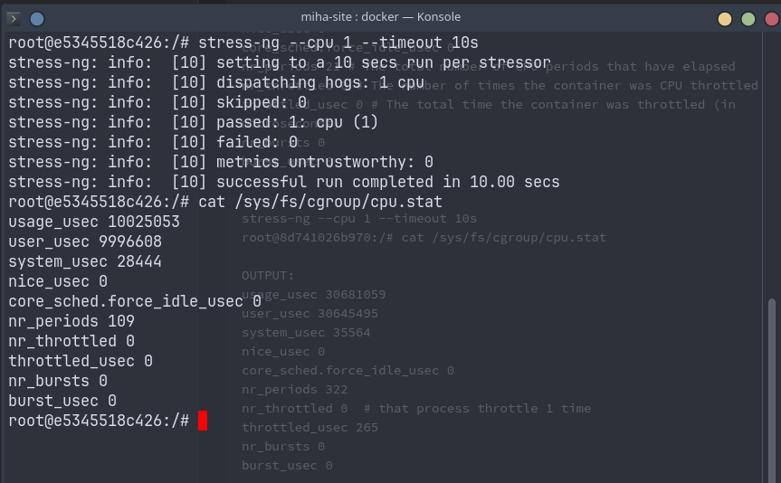
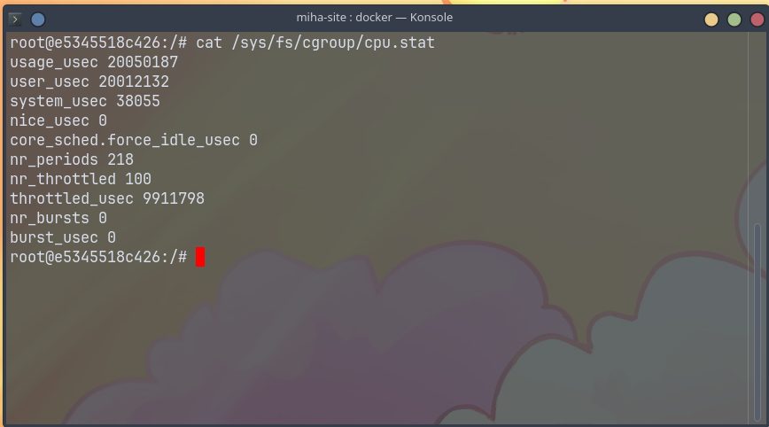

# 1. CPU switch context

First, I want everyone to understand how the CPU handles processes. Assume we have a single CPU with one core. In principle, at any given moment, only one process can use that CPU core for computation.

That means processes must be scheduled to take turns using the CPU, and the `Linux kernel scheduler` is responsible for deciding that schedule, including how long each process gets to run.

As for how the `Linux kernel scheduler` determines time slices and process priority, that is a deeper topic and something we will cover in a separate blog post.



As shown in the diagram, each process is only allowed to use the CPU for a limited window of time. Once that `time slice` is over, the CPU is handed off to another process. This actions is what we call a `context switch`.

These switches happen so quickly that users often perceive the system as running many tasks in parallel, even though a single CPU core can only execute one process at a time.

As we have seen, no process is actually assigned to a specific “1 core” or “2 cores.” However, when using **Kubernetes** or **containers**, we often set a **CPU limit** such as 1 core or 2 cores. So what does this really mean? What exactly is being limited?

# 2. CPU Time
These are the key concepts we need to understand:

`wall-clock time (elapsed time)`: the total time the process has been running

`cpu time`: the total time the process has actually **used the CPU**



Note: Both wall-clock time and CPU time are not the same as the time slice mentioned in the previous section. The purpose of that section was only to give a high-level understanding of how processes use the CPU.

Example:
- **Thread A:** uses 10ms of CPU time
- **Thread B:** uses 50ms of CPU time

=> Total CPU time of the process = 60ms

Note:
CPU time is the total execution time across all CPU cores (excluding waiting time).
If multiple threads run in parallel on different cores, their CPU time is still accumulated.

CPU time can be broken down into several components:
- `user_time:` time spent executing in **user space** (application code)
- `system_time: `time spent in **kernel space** (system calls, I/O handling, etc.)
- `nice_time`
- `irq_time`
- `softirq_time`
- `steal_time`

So, when you use monitoring tools and see a "% CPU" chart, what does it actually represent?

```
CPU % = CPU time / Wall clock time
```

Ref docs:
- [Source for htop calculation](https://github.com/htop-dev/htop/blob/37d30a3a7d6c96da018c960d6b6bfe11cc718aa8/linux/Platform.c#L324)
- [CPU Utilization - A useful metric?](https://www.green-coding.io/case-studies/cpu-utilization-usefulness/#:~:text=CPU%20utilization%20is%20defined%20as,on%20the%20idle%20thread.%E2%80%9D)
# 3. `CPU quota` in Linux
If you have used Docker or Kubernetes before, you may know that we can set a CPU limit for each container or pod. But what does this limit actually control?

First, we need to understand two important values:
- `period`: the time window that the kernel uses to control **CPU usage**
- `quota`: the maximum amount of **CPU time** that can be used within one period

**Ví dụ:**
- `period = 100000 µs = 100 ms`
- `quota = 50000 µs = 50 ms`

This means that in every `100ms`, the process can use up to `50ms` of **CPU time**.  In simpler terms, every `100ms`, the process is allowed to use `50ms` of **CPU time**.

**How to calculate vCPU (CPU cores):**
```
vCPU (cores) = quota / period
```

**Ví dụ:**
- 200ms / 100ms = 2 core

Wait, how can a process use `200ms` of CPU time within a `100ms` period?

This happens when the process runs on multiple CPU cores at the same time.

For example, if a process has 2 threads and each thread runs on a separate CPU core:
- Thread A uses **50ms** of CPU time
- Thread B uses **50ms** of CPU time

=> Total CPU time = **100ms**

This means the process has already used 100% of its CPU quota, even though only **50ms** of **wall-clock time** has passed.

This is important:
**Using multiple cores does not increase the CPU quota. It only makes the quota get used up faster.**

**CPU throttle:**

Imagine you are given a fixed budget of **50 dollars** each week. 
If you spend it all in the **first few days,** you won’t be able to spend anything until the next week. 
**CPU throttling** works in a similar way: 1 the `CPU quota` is used up, the process must wait until the next `period` to continue.

Nếu chưa hết thời gian `period` để được cấp `quota` mới mà process đã sử dụng hết `quota` thì trong khoảng thời gian sau đó process sẽ không được sử dụng CPU nữa. Khi đó CPU sẽ throttle, bắt buộc phải chờ tới khi tới `period` time để được cấp `quota` mới.

If a process consumes its entire `CPU quota` before the end of the current `period`, it will be prevented from running for the rest of that period. 
This is known as **CPU throttling.** The process must wait until the next period begins, when the **quota is reset**, before it can run use  CPU again.

**Example:**
- If a container uses up `50ms` of **CPU time** within the first `20ms`, then it will be blocked for the remaining `80ms` of the period.

So, when we set a CPU limit in **Kubernetes** or **containers**, we are essentially limiting the **CPU quota.**

**That is how we limit CPU resources!** 

Let create 1 container:
```sh
docker run -it --rm --cpus="1.0" --entrypoint /bin/bash ghcr.io/colinianking/stress-ng
```

We can check `period` and `quota` of container:
```
---
cat /sys/fs/cgroup/cpu.max 

OUTPUT:
100000 100000

#Note:
quota = 100000 µs = 100 ms  
period = 100000 µs = 100 ms

---
cat /sys/fs/cgroup/cpu.stat

OUTPUT:
usage_usec 53558 # CPU time
user_usec 34843 # CPU time in user space
system_usec 18715 # CPU time in kernel space
nice_usec 0 
core_sched.force_idle_usec 0
nr_periods 21 # The total number of CPU periods that have elapsed 
nr_throttled 0 # The number of times the container was CPU throttled
throttled_usec 0 # The total time the container was throttled (in microseconds)
nr_bursts 0
burst_usec 0
```
![[miha-site/content/blog/blog_005/images/03.png]]

```
--- 
stress-ng --cpu 1 --timeout 10s
cat /sys/fs/cgroup/cpu.stat  

OUTPUT: 
usage_usec 10025053
user_usec 9996608
system_usec 28444
nice_usec 0
core_sched.force_idle_usec 0
nr_periods 109
nr_throttled 0
throttled_usec 0
nr_bursts 0
burst_usec 0
```


```
--- 
stress-ng --cpu 2 --timeout 10s
cat /sys/fs/cgroup/cpu.stat  

OUTPUT:
usage_usec 20050187  
user_usec 20012132  
system_usec 38055  
nice_usec 0  
core_sched.force_idle_usec 0  
nr_periods 218  
nr_throttled 100 # Throttle 100 time 
throttled_usec 9911798 # ~9.9s 
nr_bursts 0  
burst_usec 0
```

As you can see, when we run a stress test with 2 CPU workers, the process is throttled around **100 times**. But why does this number come out to be about **100**?

```
stress-ng --cpu 2 --timeout 10s
---
quota  = 100ms
period = 100ms 
runtime ≈ 10s 
nr_throttled = 100
---
nr_throttled ≈ 10s / 0.1s = 100 
throttled_usec ≈ 9.9s 
```
# 4. Monitor chart: 50% CPU but why performance drop

