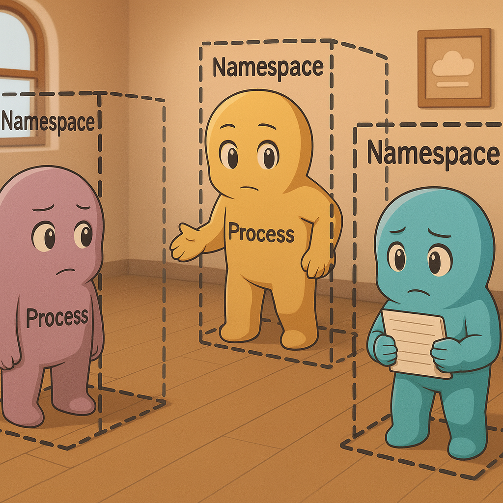
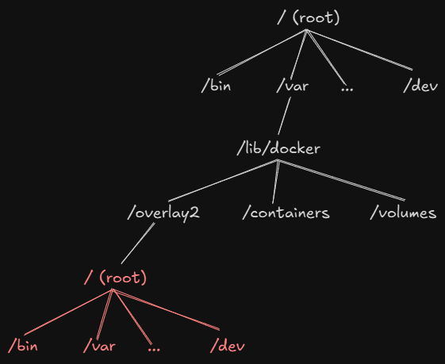
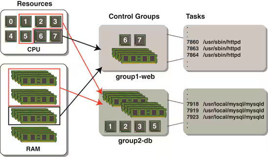

## 1. Why should you care?

When you run a Docker container, like this:
```bash
docker run nginx
```
...and somehow, a **tiny isolated world** pops into existence — with its own filesystem, processes, hostname, and even IP address.

But ever wondered why it works? Let’s peek under the hood — cgroups, namespaces, image layers, and all the nerdy stuff you pretend to understand.

---

## 2. The magic ingredient
When Docker “creates” a container, it’s really:
- Starting a process on the host.
- Wrapping that process in **namespaces** (to hide other stuff).
- Putting it inside **cgroups** (to limit resources).
- Giving it a filesystem view (via mount namespaces & overlay filesystems).

Let’s see this in action.

---
## 3. Namespaces — _What can you see?

Think of your computer as a giant open space. Without rules, every program can see:
- All files
- All processes
- All networks


That’s like living in a house **with no walls**.

Now imagine building invisible walls around each app. Each app now thinks it's the only one living in the house. That invisible walls is ***namespaces***

#### TL;DR Namespaces
- **Namespaces** = isolation of _what you can see_.
- MNT namespaces make each container think it owns `/`.
- Other namespaces isolate PID, NET, IPC, UTS, USER, and TIME.

---
### 3.1 Spin up a container
```bash
docker run --name nginx -d nginx
```

---
### 3.2 Find its main process PID
```bash
docker inspect --format '{{.State.Pid}}' nginx

OUTPUT:
240649
```

Why?  
This PID is the **main process** running inside the container, but from the host’s point of view.

---
### 3.3 Check what namespaces a container is using
```bash
sudo ls -l /proc/240649/ns

OUTPUT: 
total 0 
lrwxrwxrwx 1 root root 0 Aug  8 13:50 cgroup -> 'cgroup:[4026531835]' 
lrwxrwxrwx 1 root root 0 Aug  8 13:50 ipc -> 'ipc:[4026532606]' 
lrwxrwxrwx 1 root root 0 Aug  8 13:47 mnt -> 'mnt:[4026532263]' 
lrwxrwxrwx 1 root root 0 Aug  8 13:47 net -> 'net:[4026532608]' 
lrwxrwxrwx 1 root root 0 Aug  8 13:50 pid -> 'pid:[4026532607]' 
lrwxrwxrwx 1 root root 0 Aug  8 13:50 pid_for_children -> 'pid:[4026532607]' 
lrwxrwxrwx 1 root root 0 Aug  8 13:50 time -> 'time:[4026531834]' 
lrwxrwxrwx 1 root root 0 Aug  8 13:50 time_for_children -> 'time:[4026531834]' 
lrwxrwxrwx 1 root root 0 Aug  8 13:50 user -> 'user:[4026531837]' 
lrwxrwxrwx 1 root root 0 Aug  8 13:50 uts -> 'uts:[4026532264]'
```
Cool, you can see all the namespaces this container process is attached to.  Each entry follows the pattern:
```bash
<namespace_type> -> '<namespace_type>:[namespace_ID]'
```
- **`namespace_type`** → which namespace we’re looking at (mnt, net, pid, etc.) 
- **`namespace_ID`** → the unique ID of that namespace in the kernel. 
- If two processes have the same ID for a given type, they share that namespace.

Types include:
- `mnt` — Filesystem view
- `pid` — Process IDs
- `net` — Network interfaces
- `ipc` — Inter-process communication
- `uts` — Hostname/domain
- `user` — User/group IDs
- `time` — System clocks
>**Tip**: If two processes share the same namespace ID for a type, they share that namespace
---
### 3.4 Peek at the MNT (mount) namespace
```bash
mnt -> 'mnt:[4026532263]'
```

You can exec into the container and see that the container has its ***own filesystem***
```bash
docker exec -it nginx ls / 

OUTPUT: 
bin  boot  dev  docker etc  home  lib  lib64  media  mnt  opt  proc  root  run  sbin ...
```
Looks like a complete Linux filesystem… but it’s just a _mapped_ folder on the host.


---
### 3.5 Where is it really stored?
```bash
# Get container's ID 
docker inspect --format '{{.Id}}' nginx 

OUTPUT: 
967db174494915398f42a23819eda2a1e4fb72fb2879ae70a87d348c5d1eebfb 

# Find the container’s root filesystem on the host 
docker inspect --format '{{.GraphDriver.Data.MergedDir}}'  967db174494915398f42a23819eda2a1e4fb72fb2879ae70a87d348c5d1eebfb 

OUTPUT: 
/var/lib/docker/overlay2/a56aaad745c20bba.../merged 

# List all filesystem  
sudo ls /var/lib/docker/overlay2/a56aaad745c20bba.../merged

OUTPUT:
<empty>
```
If you `ls` that folder from your normal shell, it might look empty.  
Why that?  
You’re in the wrong **mount namespace**.

---
### 3.6 Sneak into Docker’s mount namespace
Docker keeps these mounts in `dockerd`’s private mount namespace.
To see them, you need to _sneak in_:
```bash
# Enter dockerd's mount namespace 
sudo nsenter --target $(pgrep -x dockerd | head -n1) --mount -- bash 

# Now list the container's root filesystem 
ls -la /var/lib/docker/overlay2/a56aaad745c20bba.../merged 

OUTPUT: 
bin  boot  dev  docker etc  home  lib  lib64  media  mnt  opt  proc  root  run  sbin ...
```
Boom — now you see what the container sees as `/`.

---
## 4. Cgroups — _How much can you use?_

Namespaces hide stuff.  
**Cgroups** control _how much_ you get to use.

They’re like a bouncer at a party:
- “You, only 50% CPU.”
- “You, max 256 MB RAM.”
- “You… no network for you.”

#### TL;DR Cgroups
- **Cgroups** = limit _how much_ resources a container can consume.
- Docker writes these limits to the cgroup filesystem.
- The kernel enforces them automatically.


---

### 4.1 Create a limited container

```bash
docker run -m 256m --cpus=0.5 nginx
```
This says:
- Max memory: **256 MB**
- Max CPU: **0.5 cores**
---
### 4.2 Find the cgroup path

```bash
# Find its main process PID
docker inspect --format '{{.State.Pid}}' nginx

OUTPUT:
1984

# List cgroup memberships for that PID
cat /proc/1984/cgroup

OUTPUT:
0::/system.slice/docker-563720d58a5bdc46e6ce27d340cbf2cfe301ecaba2b67951da3770b6ac76cc4a.scope
```
- **`0`** → cgroup v2 unified hierarchy.
- **system.slice** → managed by systemd.
- **docker.docker_id.scope → group for this container’s processes.
 
---
### 4.3 See the actual limits

```bash 
cd /sys/fs/cgroup/system.slice/docker-<container_id>.scope

OUTPUT:
cpu.max  memory.max  memory.min  cpu.idle ...

cat cpu.max

OUTOUT:
50000 100000
# 50000 100000  → 50ms of CPU time every 100ms = 0.5 cores

cat memory.max
OUTPUT:
268435456
# 268435456 bytes = 256 MB
```

---
## 5. Wrapping It All Up

We just pulled back the curtain on what actually happens when you run a Docker container:

- **Namespaces** → Decide *what you can see*.  
  - Your container gets its own view of processes, filesystems, networks, etc.  
  - Like invisible walls separating roommates in the same house.

- **Cgroups** → Decide *how much you can use*.  
  - Control CPU, memory, PIDs, and more.  
  - Like a bouncer making sure no one eats *all* the snacks.

- **Overlay Filesystem & Mount Namespaces** → Give the container its own “root” directory.  
  - Looks like a complete OS, but it’s just a mapped folder on the host.

---
### Key Takeaways
1. Docker containers are **just processes** with special kernel features applied.
2. You can **inspect namespaces** via `/proc/<PID>/ns` to see isolation in action.
3. You can **inspect cgroups** via `/sys/fs/cgroup` to see and adjust resource limits.
4. The “magic” is **inside the Linux kernel**, not in Docker itself.

---

**Final thought**:  
Next time someone says “containers are lightweight VMs,” you can smile knowingly — because you *actually* understand the Linux magic making it happen.

